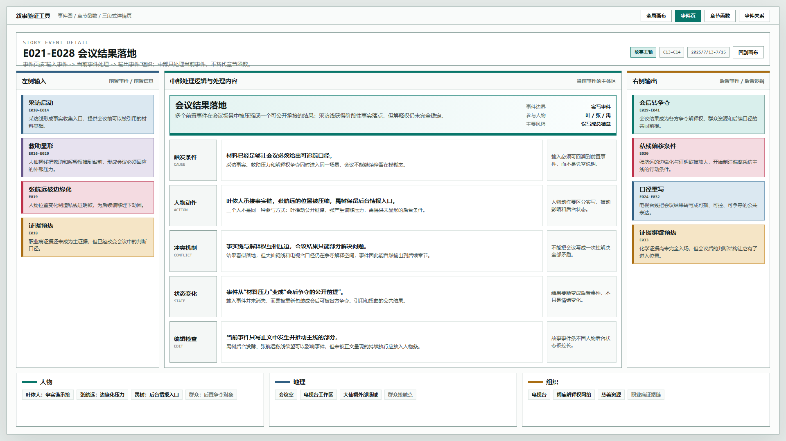
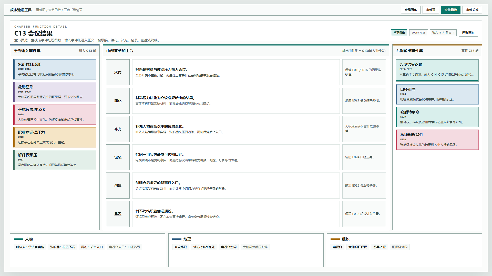
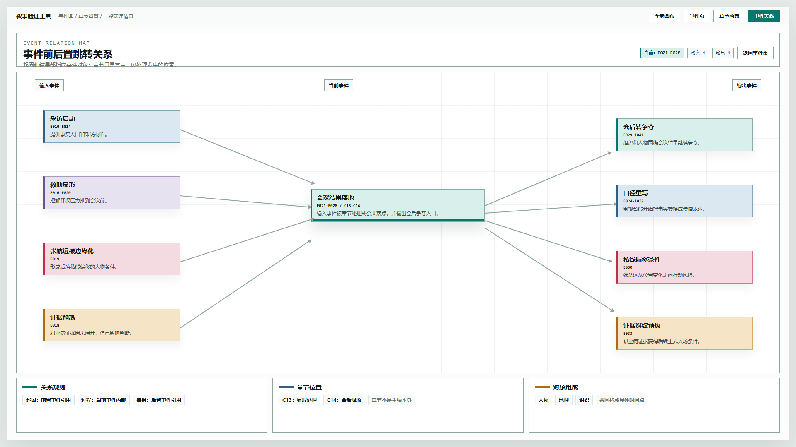
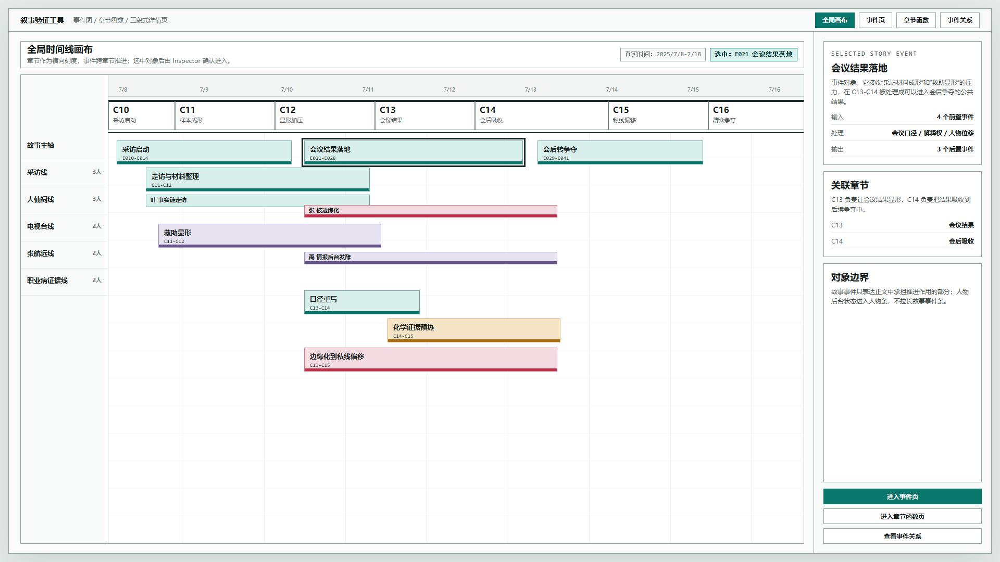

# 叙事验证工具 - 事件章节三段式关系原型 v11

## 元信息

- 版本：v11
- 状态：供用户评审
- 继承版本：v10 对象详情页路由原型
- 目标画板：1920 x 1080
- 目标入口：`source/index.html`
- 设计说明：`../../设计说明/2026-06-20-事件章节函数关系与三段式页面设计-v0.2.md`

## 本版定位

V11 不是继续增加 Inspector 字段，而是验证新的对象详情页语法：

```text
左侧输入 -> 中部处理逻辑与处理内容 -> 右侧输出
```

该语法同时应用在事件页和章节函数页：

- 事件页：前置事件进入当前事件，当前事件处理后输出后置事件。
- 章节页：输入事件集进入章节函数，章节处理后输出事件集。

页面下缘统一放置人物、地理、组织上下文，用来表达具体时间点由哪些对象构成。

## 共用定义

### 事件

事件是独立叙事过程，不是章节摘要。事件详情页必须能追踪：

- 输入：前置事件或前置信息。
- 处理：谁、在哪里、受到什么组织压力、做了什么、状态如何变化。
- 输出：后置事件或后置逻辑。

基础事件可以没有输入，但仍需要说明触发条件。

### 章节函数

章节是正文函数，表达为：

```text
输出事件集 = 章节函数(输入事件集)
```

章节页的重点不是正文摘要，而是承接、演化、补充、重新包装、创建、终结输入事件。

### 人物、地理、组织

任何具体时间点都由人物、地理和组织构成。V11 把这三类对象放在页面下缘，作为事件和章节处理的上下文带。

## 图文证据链

### 01-事件详情三段式-1920x1080.png

- 评阅状态：供用户确认
- 画板规格：1920 x 1080
- 设计依据：事件页按输入、处理、输出组织，中部为当前事件的主体处理区。
- 需要判断：这是否比普通详情表更符合事件的因果定义。
- 不可接受偏差：事件页变成章节摘要，或把人物后台行为写成故事事件延长。



### 02-章节函数事件加工台-1920x1080.png

- 评阅状态：供用户确认
- 画板规格：1920 x 1080
- 设计依据：章节接收输入事件集，通过章节内部处理输出新事件集。
- 需要判断：章节函数是否清楚表达“章节处理事件集”。
- 不可接受偏差：章节页只做正文概述，不能追踪事件输入输出。



### 03-事件前后置跳转关系-1920x1080.png

- 评阅状态：供用户确认
- 画板规格：1920 x 1080
- 设计依据：起因和结果都应尽量指向事件对象，便于跳转和追踪。
- 需要判断：事件图是否能辅助理解输入、处理、输出的来源。
- 不可接受偏差：起因和结果只剩散文说明，没有对象引用。



### 04-全局画布到事件章节路由-1920x1080.png

- 评阅状态：供用户确认
- 画板规格：1920 x 1080
- 设计依据：全局画布只负责定位对象，Inspector 负责确认和进入。
- 需要判断：入口逻辑是否仍保持“先选中，再明确进入”。
- 不可接受偏差：点击画布对象后自动跳转详情页。



## 查看方式

打开：

```text
source/index.html#timeline
source/index.html#event
source/index.html#chapter
source/index.html#graph
```

## 原型到实现映射

- `#timeline`：全局画布，选中事件后在 Inspector 中确认。
- `#event`：事件详情页，左输入、中处理、右输出。
- `#chapter`：章节函数页，左输入事件集、中章节加工、右输出事件集。
- `#graph`：事件前后置关系图。

后续实现时可以把 hash 路由替换为正式前端路由，但事件与章节的对象边界不应变化。

## 非目标

- 不实现真实保存。
- 不接入数据库。
- 不替代 V9 的多轨时间轴交互。
- 不继续讨论章节视觉权重问题。
- 不定义人物线详情页的最终形态。

