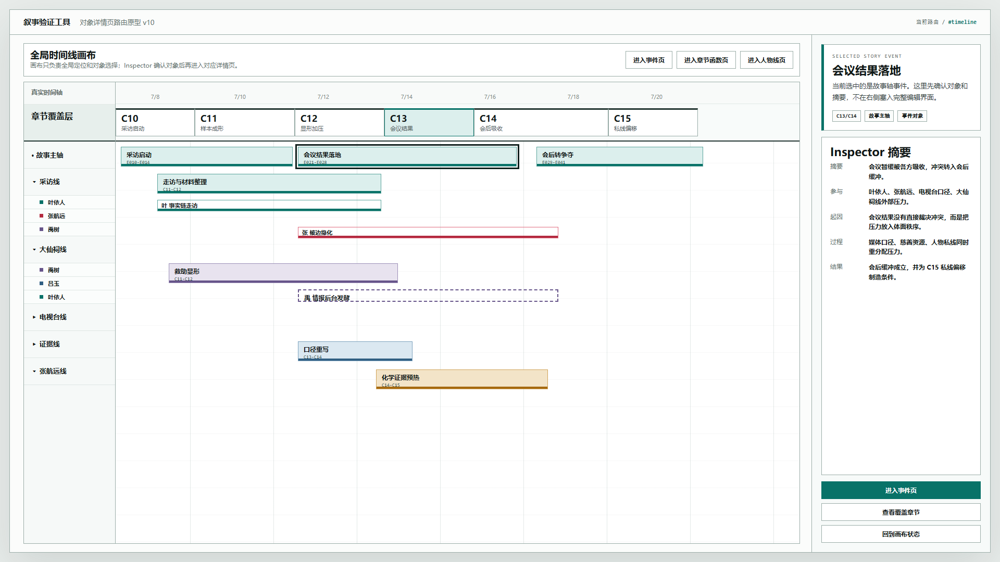
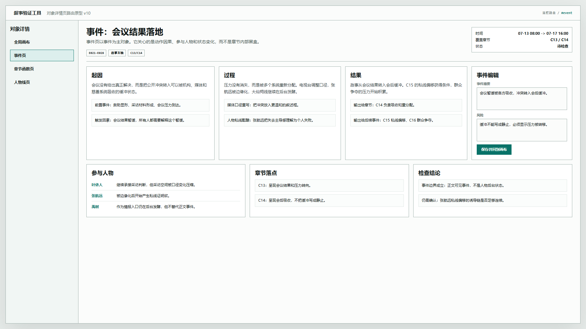
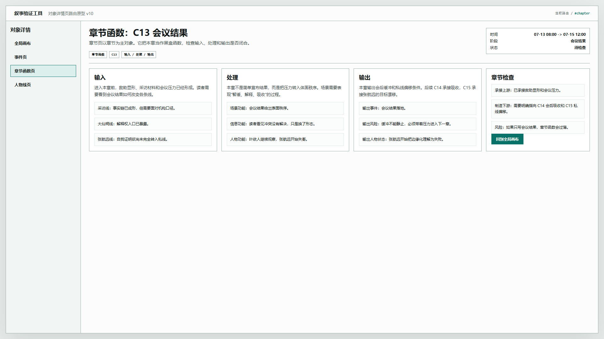
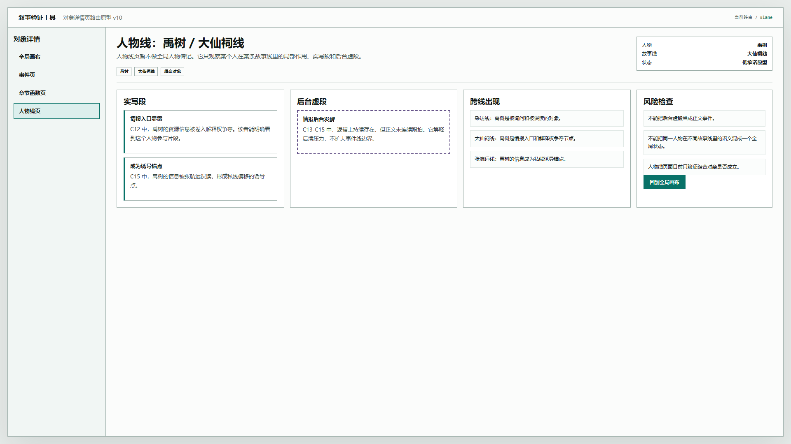

# 叙事验证工具 - 对象详情页路由原型 v10

## 元信息

- 版本：v10
- 状态：待用户确认
- 继承版本：v9 真实时间轴底盘原型
- 目标画板：1920 x 1080
- 目标入口：`source/index.html`
- 页面主对象：全局时间线、故事事件、章节函数、人物线组合对象
- 设计说明：`../../设计说明/2026-06-20-对象详情页与Inspector路由设计-v0.1.md`

## 本版定位

V10 验证一个结构判断：主画布只负责全局定位和对象选择；Inspector 只负责确认选中对象并提供进入动作；真正深入分析时，应进入对象级页面。

本版不继续强化章节覆盖层视觉，也不修改 V9。V10 只验证三类对象的详情页路由逻辑：

1. 故事事件页：看动作因果、参与人物和状态变化。
2. 章节函数页：看输入、处理、输出。
3. 人物线页：先作为“人物 / 故事线”的组合对象，不做全局人物传记。

## 非目标

- 不接入真实数据文件。
- 不实现保存。
- 不实现复杂路由框架。
- 不解决人物全局传记页。
- 不替代 v9 的多轨时间轴交互。
- 不把本版视觉样式作为最终样式标准。

## 共用事实源与设计依据

- 用户要求：事件 Inspector 应包含摘要、参与人物、起因、过程、结果；进入后应以事件为对象。
- 用户要求：章节函数应进入独立页面，展示输入、处理、输出。
- 用户说明：人物线展示方式暂未完全确定。
- 既有事实源：v9 真实时间轴底盘原型。
- 设计文档：`../../设计说明/2026-06-20-对象详情页与Inspector路由设计-v0.1.md`。

## 画板规格与布局预算

- 桌面画板：1920 x 1080。
- 顶栏：48px。
- 全局画布态：左侧画布 + 右侧 Inspector。
- 详情页态：左侧对象导航 + 右侧对象详情。
- 静态图只表达页面结构与对象边界，不表达真实持久化。

## 图文证据链

### 01-全局画布选中事件-1920x1080.png

- 评阅状态：待用户确认
- 画板规格：1920 x 1080
- 设计依据：画布只做全局定位；选中事件后由 Inspector 提供事件摘要与进入入口。
- 需要判断：右侧 Inspector 是否适合只保留摘要和进入动作。
- 允许偏差：事件条位置、颜色和字段密度可调整。
- 不可接受偏差：点击事件直接进入详情；Inspector 承载完整详情。



### 02-事件详情页-1920x1080.png

- 评阅状态：待用户确认
- 画板规格：1920 x 1080
- 设计依据：事件页以事件为对象，展示摘要、因果拆解、参与人物、章节落点和编辑区。
- 需要判断：事件页字段是否足以支持事件级编辑和检查。
- 允许偏差：编辑区位置、字段顺序可调整。
- 不可接受偏差：事件页变成章节页或人物传记页。



### 03-章节函数页-1920x1080.png

- 评阅状态：待用户确认
- 画板规格：1920 x 1080
- 设计依据：章节页以章节为对象，核心结构为输入、处理、输出。
- 需要判断：这是否符合“章节函数”的黑盒拆解方式。
- 允许偏差：输入、处理、输出的视觉布局可调整。
- 不可接受偏差：章节函数继续停留在右侧小面板。



### 04-人物线页-1920x1080.png

- 评阅状态：待用户确认
- 画板规格：1920 x 1080
- 设计依据：人物线暂定为“人物 / 故事线”的组合对象，不做全局人物传记。
- 需要判断：人物线页是否应继续沿这个低承诺方向推进。
- 允许偏差：人物线页可以暂缓实现。
- 不可接受偏差：把人物线直接做成全局人物传记，导致故事线语义混乱。



## 原始材料说明

本版无外部原始图片。用户意见来自当前会话中的文字需求。

## 原型到实现映射

- `#timeline`：全局时间线画布，选中事件后展示 Inspector。
- `#event`：事件详情页，主对象是故事事件。
- `#chapter`：章节函数页，主对象是章节。
- `#lane`：人物线页，主对象是人物 / 故事线组合。

后续如果进入实现，可将 hash 路由替换为真实前端路由，但对象边界不应改变。

## 允许偏差

- 页面视觉样式可继续调整。
- 字段数量可按数据模型增减。
- 人物线页可先作为低承诺原型保留。
- 事件页和章节页可增加编辑状态、只读状态和差异检查状态。

## 不可接受偏差

- 画布直接跳转，不经过 Inspector 确认。
- 事件页、章节页、人物线页对象边界混用。
- 章节函数继续塞在右侧小面板里。
- 人物线虚段替代故事线事件。

## 查看与再生成

打开：

```text
source/index.html#timeline
source/index.html#event
source/index.html#chapter
source/index.html#lane
```

截图使用 Playwright / Chrome 以 1920 x 1080 视口生成。

## 评审结论

当前状态：待用户确认。

