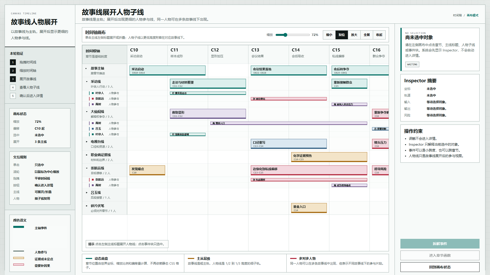
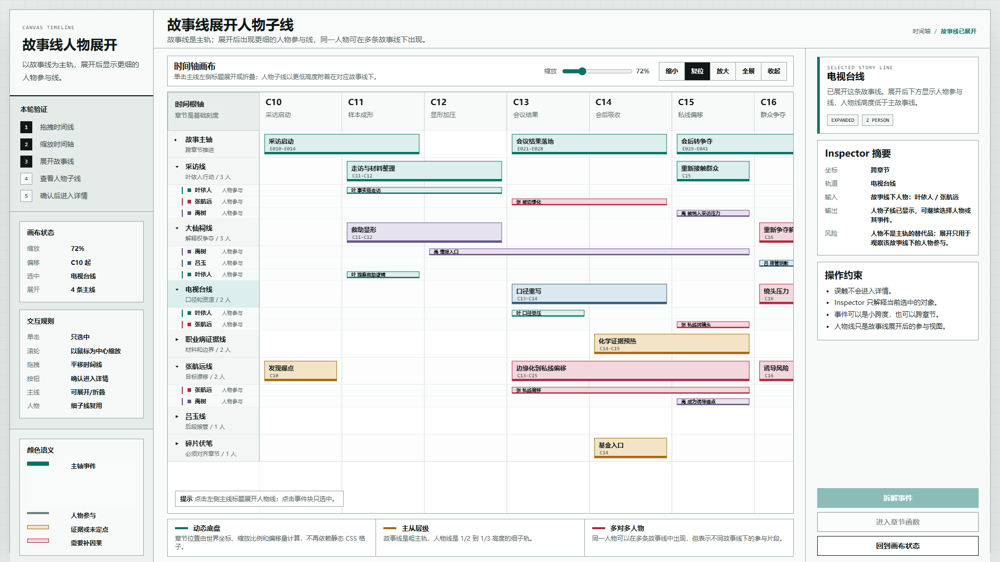
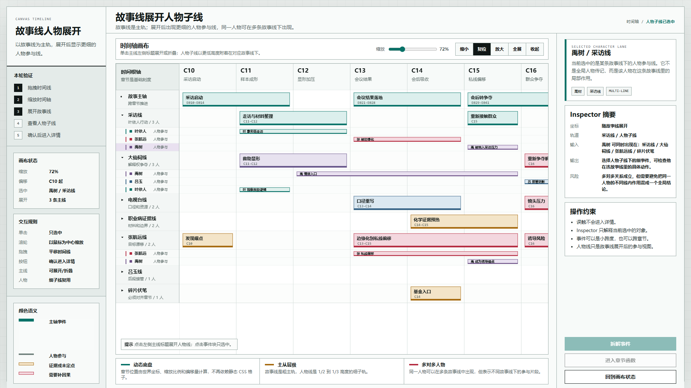
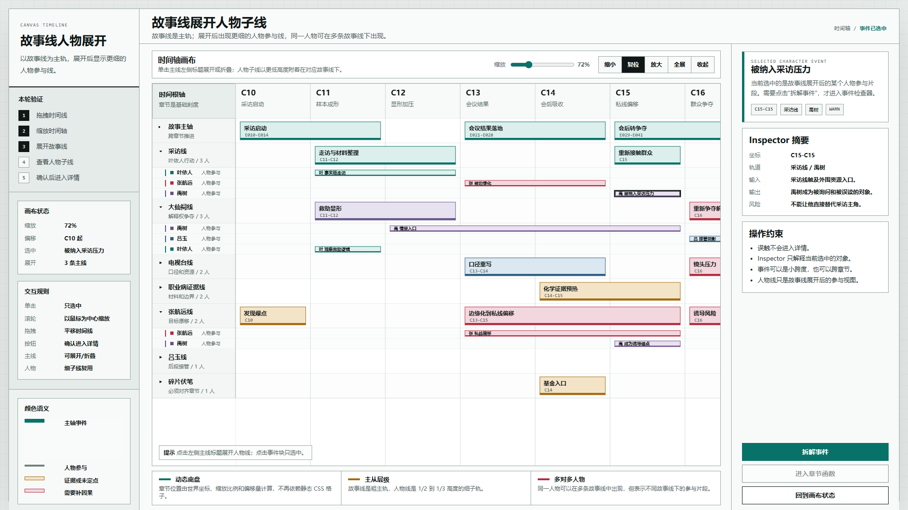
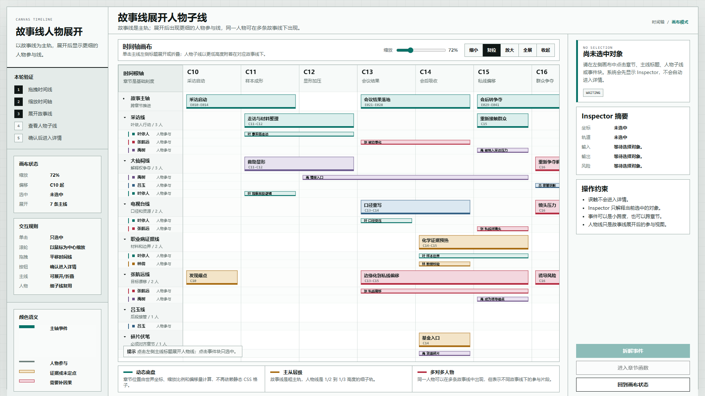
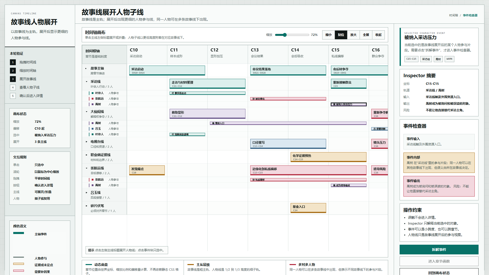
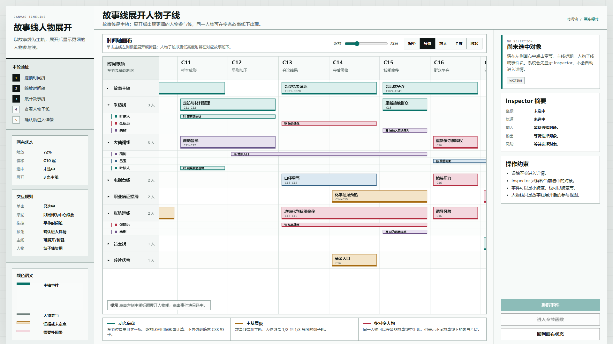
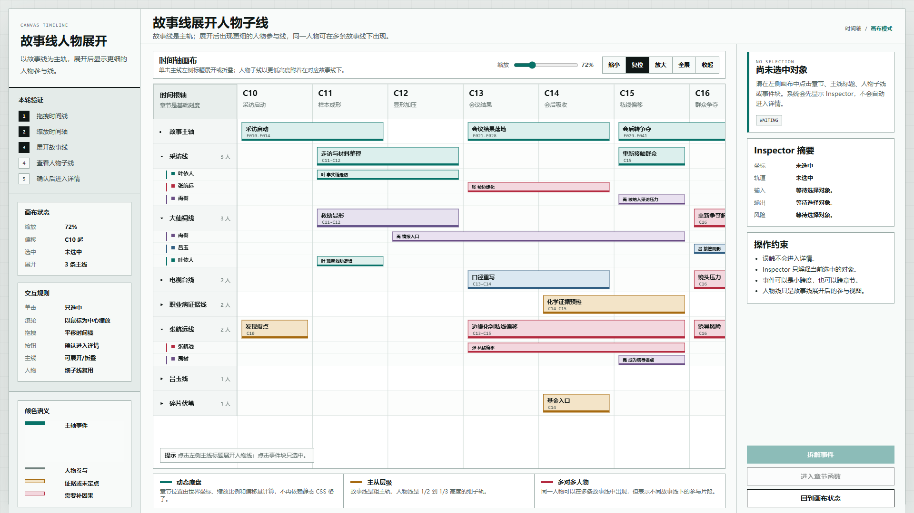
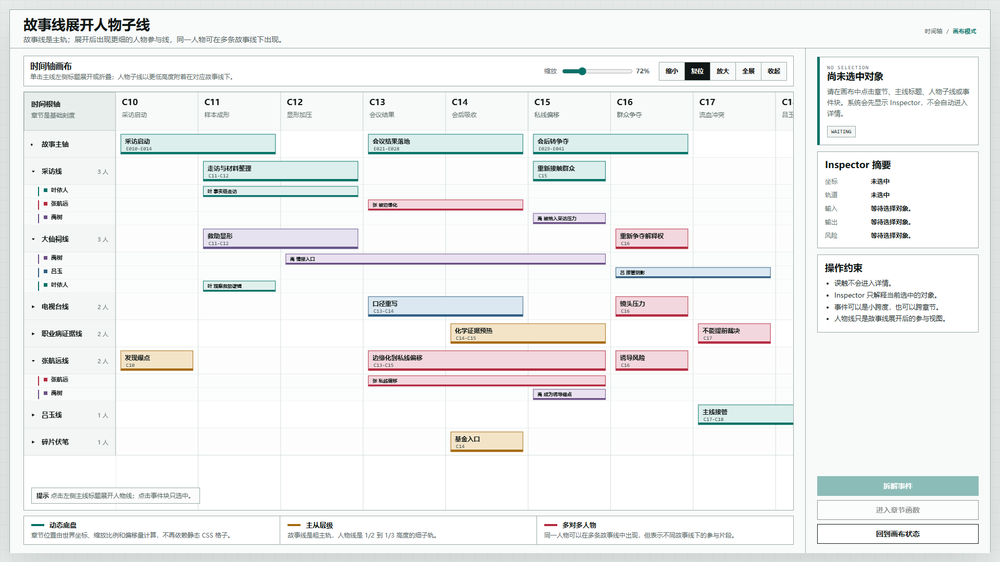

# 叙事验证工具 故事线展开人物子线原型 v7

状态：待用户确认

生成时间：2026-06-20

目标画板：1920 x 1080 桌面评审图

## 本版定位

v7 继承 v6 的 Canvas 时间轴、章节选区、缩放、拖拽和确认进入模型，只增加一个核心结构：故事线可以展开，展开后在该故事线下方显示更细的人物参与线。

本版重点：

- 故事线仍然是横向主轨。
- 人物线不是全局平铺，而是附着在某条故事线下的子轨。
- 人物子线高度低于主故事线，当前采用 26px，约为主线 52px 的 1/2。
- 人物事件块高度当前采用 20px，增强可读性，同时仍低于主事件块。
- 一条故事线可以有多个人物子线。
- 同一人物可以出现在多条故事线下，但表示不同故事线中的参与片段。
- 轨道标题区只显示线名和人数，不再显示“目标、解释权、口径”等说明性副标题。
- 移除左侧验证说明栏，让画布成为主入口；状态和解释集中在顶部工具栏与右侧 Inspector。

## 非目标

- 不实现正式数据保存。
- 不实现事件块拖拽改章节。
- 不接入正式小说文档。
- 不把人物线提升为和故事线同级的全局主轨。
- 不覆盖 v6 基准原型。

## 设计依据

- 用户意见：故事线横向展开后，应能关联到对应人物。
- 用户意见：人物线不应像故事线那么粗，展开后可能只占主线高度的 1/2 或 1/3。
- 用户意见：一条故事线下可以有多个人物，同一人物也可以出现在多条故事线里。
- 设计判断：人物线应是“故事线下的参与视图”，不是“人物传记总表”。

## 技术模型

```text
Track StoryLine:
  id
  name
  expanded
  characters[]

Row:
  type = track | character
  trackId
  characterId?
  height
  y

Event:
  kind = story | character
  track
  character?
  startChapter
  endChapter
```

## 核心交互

### 故事线展开

点击左侧主故事线标题，会展开或折叠该故事线下的人物子线。故事线本身仍保留主事件块。

### 人物子线

人物子线显示为更细的行，人物事件块也更细。它表达的是该人物在当前故事线里的具体动作、影响或风险。

### 轨道标签精简

左侧轨道标签只承担导航和展开入口，不承担线索解释。点击故事线即可展开人物子线，展开后直接露出人物名；具体解释交给右侧 Inspector。

### 多对多人物

同一个人物可以在多条故事线中出现。例如“禹树”同时出现在采访线、大仙祠线、张航远线和碎片伏笔中，但每条线里的含义不同。

### 选择和确认进入

点击人物子线或事件只显示 Inspector，不自动进入详情。只有点击“拆解事件”才进入事件检查器。

## 图文证据

### 01 故事线人物展开总览

文件：`01-故事线人物展开总览-1920x1080.png`



评审问题：

- 主故事线和人物子线是否有清楚层级。
- 人物线是否明显比故事线更细。
- 默认展开密度是否还能阅读。

### 02 故事线展开状态

文件：`02-故事线展开状态-1920x1080.png`



评审问题：

- 点击主线标题后是否能明确展开。
- 展开后的子线是否附着在该故事线下，而不是变成全局人物表。

### 03 人物子线选中

文件：`03-人物子线选中-禹树-1920x1080.png`



评审问题：

- 选中人物子线后，Inspector 是否解释“某故事线下的局部参与”。
- 同一人物跨多条故事线的提示是否清楚。

### 04 人物事件选中 Inspector

文件：`04-人物事件选中Inspector-1920x1080.png`



评审问题：

- 人物事件块是否能被选择。
- 人物事件是否能说明其所在故事线。
- 事件选择是否仍然不会自动进入详情。

### 05 全展开多对多视图

文件：`05-全展开多对多视图-1920x1080.png`



评审问题：

- 全展开后是否还能辨认主线和子线。
- 同一人物跨线出现是否合理。
- 人物密度是否需要折叠、筛选或搜索辅助。

### 06 确认进入人物事件检查器

文件：`06-确认进入人物事件检查器-1920x1080.png`



评审问题：

- 点击“拆解事件”后才进入事件检查器。
- 检查器是否能表达人物在某故事线下的参与片段。

### 07 精简故事线标签

文件：`07-精简故事线标签-1920x1080.png`


评审问题：

- 左侧主线行是否只承担展开入口。
- 人物子线是否能在没有解释性副标题的情况下被识别。
- 线索解释是否应全部留给 Inspector。

### 08 时间轴固定列裁剪修复

文件：`08-时间轴固定列裁剪修复-1920x1080.png`



评审问题：

- 横向拖动后，章节号是否只出现在右侧时间轴区域。
- 左侧“时间根轴”标签是否保持固定且不被章节头遮挡。
- 章节点击区域是否也被限制在时间轴区域内。

### 09 人物子线 26px / 事件块 20px

文件：`09-人物子线26事件块20-1920x1080.png`



评审问题：

- 人物子线是否比上一版更容易看清。
- 人物事件块是否仍然保持次级视觉权重。
- 人物子线之间的密度是否适合继续展开多个人物。

### 10 移除左侧说明栏

文件：`10-移除左侧说明栏-1920x1080.png`



评审问题：

- 画布是否成为页面主入口。
- 左侧草稿验证说明是否已经从真实系统界面中移除。
- 顶部工具栏和右侧 Inspector 是否足以承接必要状态。

## 原始材料说明

本版没有使用外部图片、PDF 或用户手绘图。所有新增视觉和交互结构都由 `source/index.html` 生成。

## 原型到实现映射

- 目标入口：`source/index.html`
- 页面主对象：可展开故事线和人物参与子线
- 核心组件：Canvas 时间线、故事线展开状态、人物子线、右侧 Inspector、确认进入按钮
- 数据来源：原型内置章节、故事线、人物和事件样例
- 验收方法：打开 HTML，检查故事线展开、人物子线高度、多对多人物、事件选中和确认进入。

## 允许偏差与不可接受偏差

允许偏差：

- 人物子线高度可继续微调。
- 人物事件块高度可在 18px 到 22px 间继续评估。
- 默认展开哪些故事线可继续调整。
- 人物色标可继续优化。
- 主线行的人数展示方式可继续微调。
- 颜色语义可以在后续改为图例弹层或帮助入口。

不可接受偏差：

- 人物线与故事线视觉权重完全相同。
- 同一人物只能绑定一条故事线。
- 展开后变成全局人物列表，而不是故事线下的子线。
- 点击人物线或事件后自动进入详情。
- 在轨道标题区堆叠解释性副标题，干扰展开关系。
- 将草稿验证步骤、交互规则和画布状态作为常驻左栏占据主工作区。

## 查看与重新生成

直接打开：

```text
source/index.html
```

在 `C:\OpenCodeWorkSpace\TestProject\文章重写\验证工具` 下重新生成评审图：

```powershell
$root = Resolve-Path -LiteralPath '原型包\2026-06-20-叙事验证工具-故事线展开人物子线原型-v7'
$html = Resolve-Path -LiteralPath "$root\source\index.html"
$uri = ([System.Uri]$html.Path).AbsoluteUri

npx --yes playwright screenshot --channel chrome --viewport-size=1920,1080 "$uri#canvas" "$root\01-故事线人物展开总览-1920x1080.png"
npx --yes playwright screenshot --channel chrome --viewport-size=1920,1080 "$uri#track-selected" "$root\02-故事线展开状态-1920x1080.png"
npx --yes playwright screenshot --channel chrome --viewport-size=1920,1080 "$uri#character-selected" "$root\03-人物子线选中-禹树-1920x1080.png"
npx --yes playwright screenshot --channel chrome --viewport-size=1920,1080 "$uri#event-selected" "$root\04-人物事件选中Inspector-1920x1080.png"
npx --yes playwright screenshot --channel chrome --viewport-size=1920,1080 "$uri#all-expanded" "$root\05-全展开多对多视图-1920x1080.png"
npx --yes playwright screenshot --channel chrome --viewport-size=1920,1080 "$uri#event-detail" "$root\06-确认进入人物事件检查器-1920x1080.png"
```

## 待确认

- 人物子线高度是否符合 1/2 或 1/3 的预期。
- 同一人物跨故事线出现时，是否需要更强的全局身份标识。
- 下一轮是否加入“只看某个人物”的过滤模式。
