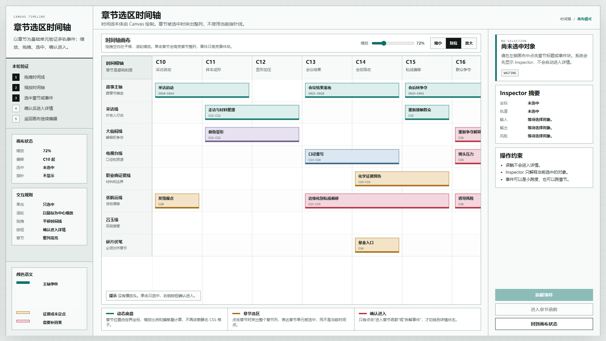
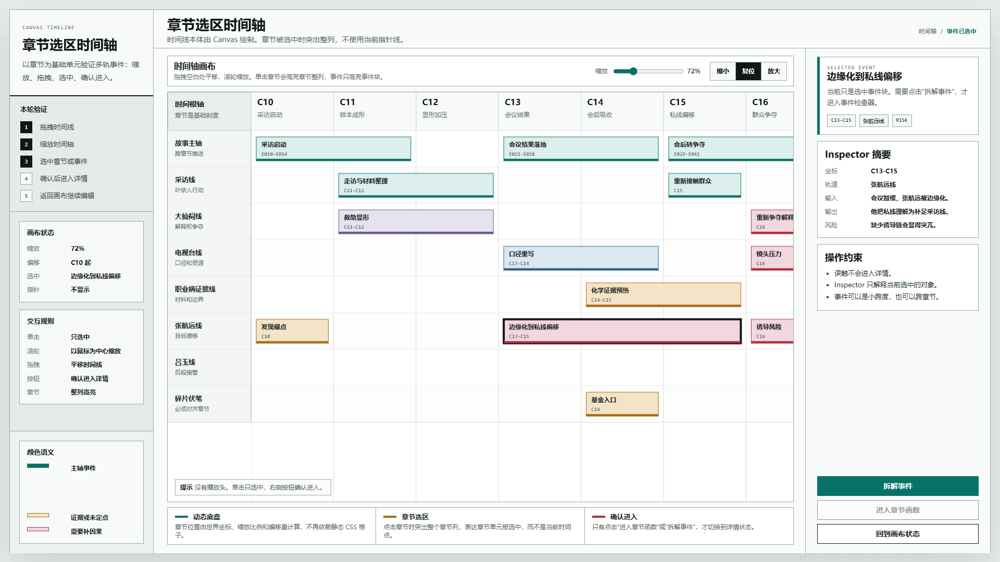
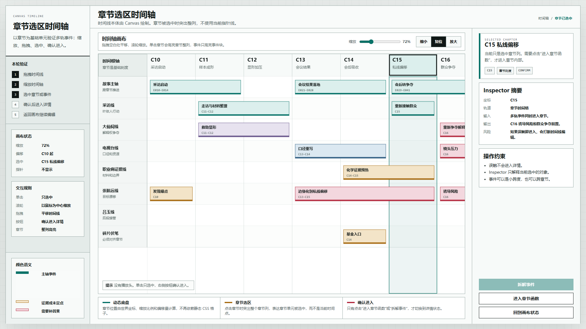
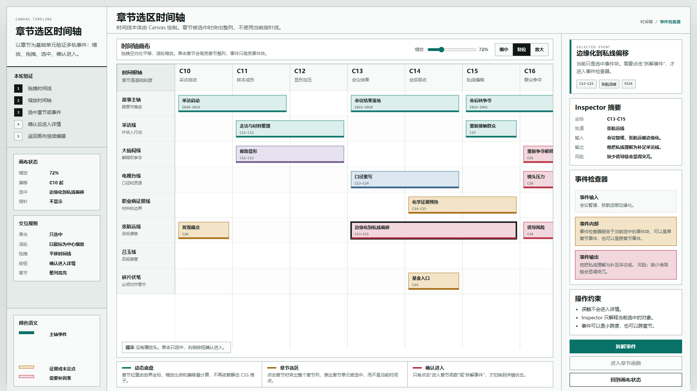
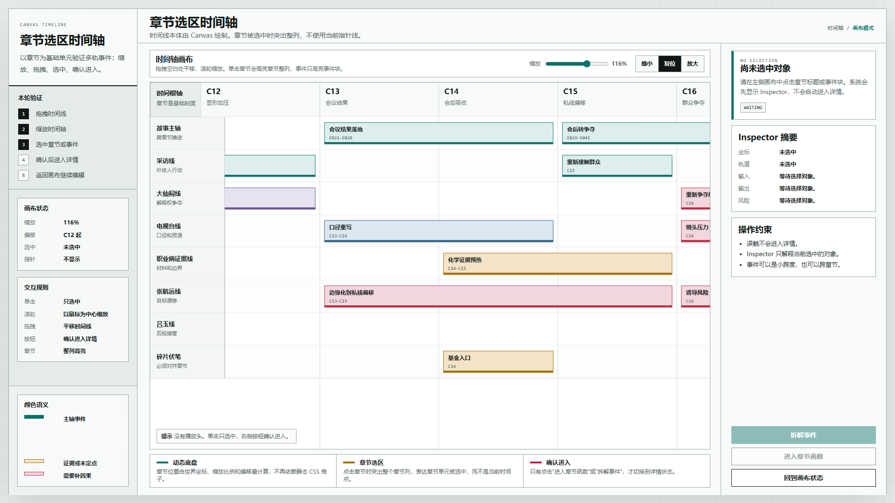

# 叙事验证工具 章节选区高亮原型 v6

状态：基准原型，继续迭代

生成时间：2026-06-20

目标画板：1920 x 1080 桌面评审图

## 本版定位

v6 继承 v5 的 Canvas 多轨时间线交互，只处理一个核心语义问题：去掉类似剪辑软件“当前播放头”的贯穿竖线，改成以章节为基础单元的整列选区。

本版重点：

- 默认状态不显示当前指针线。
- 章节被选中时，突出整个章节列。
- 事件被选中时，只突出事件块本身。
- 选中仍然只打开右侧 Inspector，不自动进入详情。
- 进入事件检查器或章节函数仍然必须点击确认按钮。

## 非目标

- 不实现保存、导入、导出。
- 不实现事件块拖拽改章节。
- 不接入正式小说文档。
- 不改变 v5 已验证的缩放、拖拽、确认进入模型。
- 不修改 `验证工具` 之外的正式材料。

## 设计依据

- 用户意见：绿色贯穿线会被理解成“当前指针”或“写到哪里”，但当前工具没有时间点和播放进度语义。
- 用户意见：选择章节后，应突出整个章节背景框，而不是出现一条竖线。
- v5 结论：Canvas 动态缩放、拖拽、选中和确认进入模型成立，但默认 C15 竖线语义不合适。
- 设计判断：时间轴在此工具中是章节对齐基准，不是播放进度基准。

## 技术模型

```text
Canvas 画布状态：
  scale    当前缩放比例
  offsetX  当前水平偏移
  selected 当前选中对象

章节选区：
  selected.type = chapter 时绘制整列背景
  不再绘制固定章节的贯穿竖线
  不再给默认 C15 添加播放头式标记

事件选区：
  selected.type = event 时只强化事件块边框

DOM 面板：
  Inspector 摘要
  事件检查器详情
  章节函数详情
  确认进入按钮
```

## 核心交互

### 缩放

滚轮在鼠标位置附近缩放时间线。顶部滑块和“缩小 / 复位 / 放大”按钮只是辅助控制，不是时间线本体。

### 拖拽

按住画布拖拽时，水平平移时间线。章节刻度和事件块根据 `offsetX` 重新计算位置。画布不表达当前时间点。

### 章节选择

点击章节标题后：

- 章节标题格高亮。
- 章节对应的整列背景柔和高亮。
- 右侧 Inspector 显示章节摘要。
- “进入章节函数”按钮启用。
- 不自动进入章节函数。

### 事件选择

点击事件块后：

- 事件块边框高亮。
- 不出现贯穿全画布的时间点线。
- 右侧 Inspector 显示事件摘要。
- “拆解事件”按钮启用。
- 不自动进入事件详情。

## 图文证据

### 01 章节选区时间轴总览

文件：`01-章节选区时间轴总览-1920x1080.png`



评审问题：

- 默认状态是否已经去掉播放头感。
- Canvas 画布是否仍然作为主工作区。
- 缩放控件和拖拽提示是否清楚。

### 02 事件选中 Inspector

文件：`02-事件选中Inspector-1920x1080.png`



评审问题：

- 点击事件后是否只选中事件块。
- 是否没有出现贯穿全画布的指针线。
- Inspector 是否明确说明“需要确认才能进入”。

### 03 章节整列选区 Inspector

文件：`03-章节整列选区Inspector-1920x1080.png`



评审问题：

- 点击章节后是否突出整个章节列。
- 章节高亮是否足够明确但不刺眼。
- “进入章节函数”是否作为明确动作存在。

### 04 确认进入事件检查器

文件：`04-确认进入事件检查器-1920x1080.png`



评审问题：

- 进入事件检查器是否仍然需要确认按钮。
- 详情区域是否仍然围绕当前选中事件。
- 返回画布入口是否清楚。

### 05 缩放拖拽无指针状态

文件：`05-缩放拖拽无指针状态-1920x1080.png`



评审问题：

- 缩放后章节刻度和事件块是否仍然对齐。
- 偏移后的画布是否能表达“当前视口只是世界坐标的一段”。
- 是否仍然没有出现当前播放头或写作进度线。

## 原始材料说明

本基准仓库已经清理上一轮探索原型，不再保留 `original/` 历史参照副本。本版没有使用外部图片、PDF 或用户手绘图，所有新增视觉和交互结构都由 `source/index.html` 生成。

## 原型到实现映射

- 目标入口：`source/index.html`
- 页面主对象：章节对齐的多轨事件时间线
- 核心组件：Canvas 时间线、左侧状态栏、右侧 Inspector、确认进入按钮
- 数据来源：原型内置章节、轨道和事件样例
- 验收方法：打开 HTML，检查默认无指针、事件选中无指针、章节选中整列高亮、确认按钮进入详情。

## 允许偏差与不可接受偏差

允许偏差：

- 章节选区颜色可以微调。
- 章节列边框粗细可以微调。
- Inspector 固定右侧或后续改为浮动面板均可继续讨论。

不可接受偏差：

- 默认状态出现贯穿全画布的当前指针线。
- 事件选中时出现类似播放头的全局竖线。
- 点击章节或事件后自动进入详情。
- 章节选中只显示一条线，而不是章节区域。

## 查看与重新生成

直接打开：

```text
source/index.html
```

在 `C:\OpenCodeWorkSpace\TestProject\文章重写` 下重新生成评审图：

```powershell
$root = Resolve-Path -LiteralPath '验证工具\原型包\2026-06-20-叙事验证工具-章节选区高亮原型-v6'
$html = Resolve-Path -LiteralPath "$root\source\index.html"
$uri = ([System.Uri]$html.Path).AbsoluteUri

npx --yes playwright screenshot --channel chrome --viewport-size=1920,1080 "$uri#canvas" "$root\01-章节选区时间轴总览-1920x1080.png"
npx --yes playwright screenshot --channel chrome --viewport-size=1920,1080 "$uri#event-selected" "$root\02-事件选中Inspector-1920x1080.png"
npx --yes playwright screenshot --channel chrome --viewport-size=1920,1080 "$uri#chapter-selected" "$root\03-章节整列选区Inspector-1920x1080.png"
npx --yes playwright screenshot --channel chrome --viewport-size=1920,1080 "$uri#event-detail" "$root\04-确认进入事件检查器-1920x1080.png"
npx --yes playwright screenshot --channel chrome --viewport-size=1920,1080 "$uri#zoomed" "$root\05-缩放拖拽无指针状态-1920x1080.png"
```

## 后续迭代事项

- 章节整列高亮是否符合你的“章节背景框突出”的意思。
- 默认无指针是否比 v5 更贴合当前工具语义。
- 下一轮是否加入事件块拖拽改章节，或先继续完善章节函数界面。
