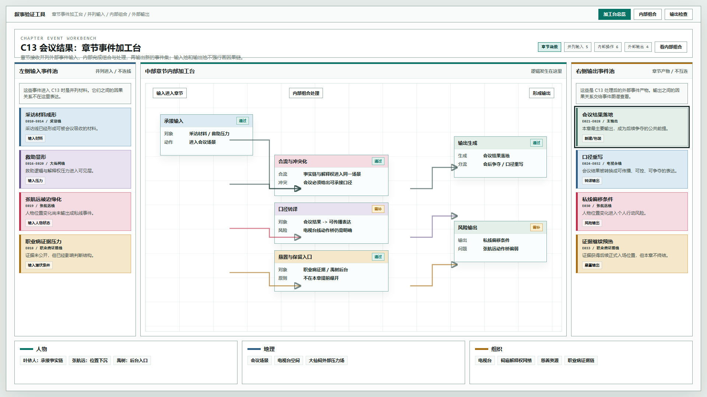
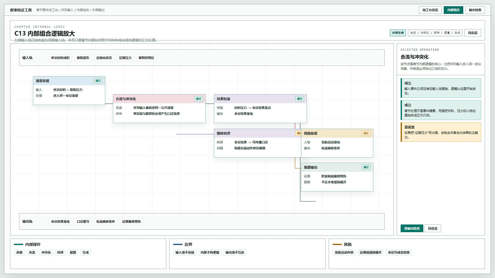
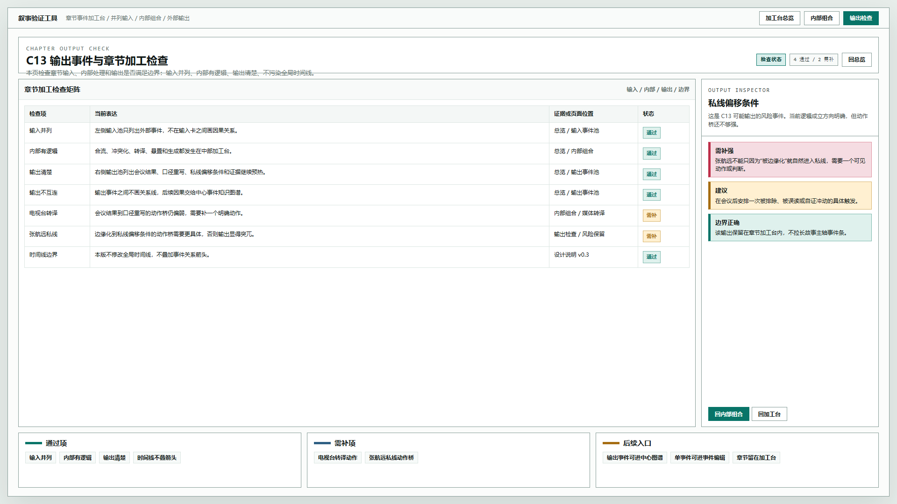

# 叙事验证工具 - 章节事件加工台原型 v14

## 元信息

- 版本：v14
- 生成时间：2026-06-21 08:07:46
- 状态：待用户确认
- 继承版本：v13 中心事件图谱与蓝图检查原型
- 目标画板：1920 x 1080
- 目标入口：`source/index.html`
- 页面主对象：章节函数 C13
- 设计说明：`../../设计说明/2026-06-21-章节事件加工台与对象编辑边界设计-v0.3.md`

## 本版定位

V14 新增“章节为中心”的事件加工台。它不再修改全局时间线，也不在全局时间线上叠加事件关系箭头。

本版验证一个核心结构：

```text
并列外部事件输入 -> 章节内部组合处理 -> 外部事件输出
```

章节输入区和输出区都保持集合形态。真正的逻辑只发生在中部章节加工台。

## 非目标

- 不修改全局时间线。
- 不给全局时间线增加事件关系箭头。
- 不替代中心事件知识图谱。
- 不替代单事件对象编辑器。
- 不接入真实保存和数据库。
- 不处理人物线详情页。

## 共用事实源与设计依据

- 用户确认：全局时间线不要再修改，事件关系箭头会把事件搞乱。
- 用户确认：章节为中心的编辑接收外部事件输入，输入是并列的，没有逻辑关系。
- 用户确认：章节内部组合才带逻辑，并最终进行外部输出。
- 设计说明：`../../设计说明/2026-06-21-章节事件加工台与对象编辑边界设计-v0.3.md`。
- 历史原型：v13 的中心事件知识图谱和蓝图式事件检查器。

## 画板规格与布局预算

- 桌面画板：1920 x 1080。
- 顶栏：44px。
- 页面主体：三段式，左侧输入池，中部加工台，右侧输出池。
- 底部：人物 / 地理 / 组织或检查上下文。
- 截图视口：1920 x 1080。

## 图文证据链

### 01-章节事件加工台总览-1920x1080.png

- 评阅状态：待用户确认
- 画板规格：1920 x 1080
- 设计依据：章节左侧输入是并列事件池，中部才是有逻辑的章节处理，右侧输出是章节产物。
- 需要判断：输入池和输出池是否避免了误读为因果链。
- 允许偏差：事件卡数量、字段密度和节点命名可调整。
- 不可接受偏差：把输入事件互相连线，或把输出事件互相强连。



### 02-章节内部组合逻辑-1920x1080.png

- 评阅状态：待用户确认
- 画板规格：1920 x 1080
- 设计依据：章节内部通过承接、合流、冲突化、转译、悬置、生成来处理并列输入。
- 需要判断：这个内部组合面是否能表达“章节函数”的猪肚部分。
- 允许偏差：内部节点可以继续细分或重命名。
- 不可接受偏差：内部处理退化成章节摘要，或输入池重新变成事件链。



### 03-章节输出与检查面板-1920x1080.png

- 评阅状态：待用户确认
- 画板规格：1920 x 1080
- 设计依据：章节页也需要检查输入是否并列、内部是否有逻辑、输出是否清楚、边界是否污染全局时间线。
- 需要判断：这种检查矩阵是否适合作为章节对象编辑的校验面。
- 允许偏差：检查项可增减。
- 不可接受偏差：把章节检查混入事件对象编辑，导致对象边界不清。



## 原始材料说明

本版无外部原始图片。设计输入来自用户文字确认、v13 原型评审意见和 v0.3 设计说明。

## 原型到实现映射

- `#overview`：章节事件加工台总览。
- `#logic`：章节内部组合逻辑放大。
- `#check`：章节输出与检查面板。

实现对象建议：

- `ChapterWorkbench`
- `ChapterInputPool`
- `ChapterProcessingCanvas`
- `ChapterOutputPool`
- `ChapterCheckMatrix`

数据关系建议：

- 章节输入：`chapter.inputEventRefs[]`
- 内部操作：`chapter.operations[]`
- 章节输出：`chapter.outputEventRefs[]`
- 检查项：`chapter.checks[]`

## 允许偏差与不可接受偏差

允许偏差：

- 视觉配色、卡片密度、节点命名可继续调整。
- 内部操作节点可扩展为更完整的蓝图式节点。
- 检查矩阵字段可按后续数据模型增减。

不可接受偏差：

- 全局时间线继续叠加事件关系箭头。
- 章节输入事件之间画因果关系。
- 章节输出事件之间画因果关系。
- 章节加工台与事件对象编辑器混成一个页面。
- 输入、内部处理、输出三段边界不清。

## 查看与再生成

打开：

```text
source/index.html#overview
source/index.html#logic
source/index.html#check
```

截图生成方式：

```powershell
$chrome='C:\Program Files\Google\Chrome\Application\chrome.exe'
$base=Resolve-Path '验证工具\原型包\2026-06-21-080746-叙事验证工具-章节事件加工台原型-v14'
$source=Join-Path $base 'source\index.html'
$url=([System.Uri](Resolve-Path $source).Path).AbsoluteUri
& $chrome --headless=new --disable-gpu --hide-scrollbars --window-size=1920,1080 --force-device-scale-factor=1 --screenshot="$base\01-章节事件加工台总览-1920x1080.png" ($url + '#overview')
```

## 评审结论与后续处理

当前状态：待用户确认。

后续需要用户判断：

1. 章节输入池是否符合“并列输入”的理解。
2. 中部加工台是否足以表达章节内部组合。
3. 输出与检查面板是否适合作为章节对象编辑的校验面。

