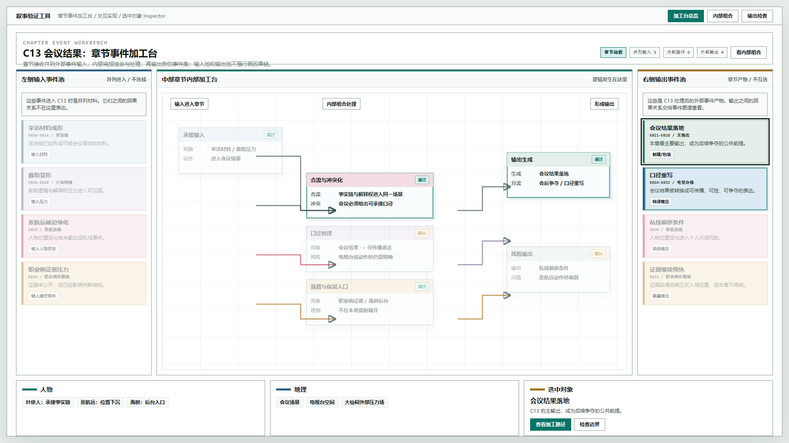
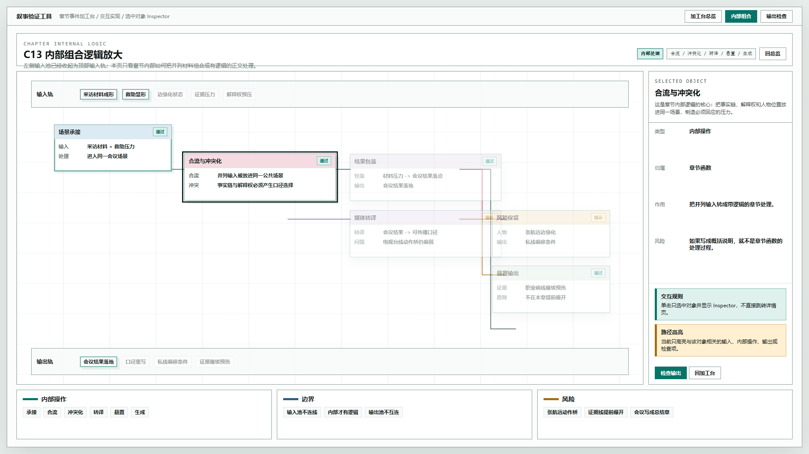
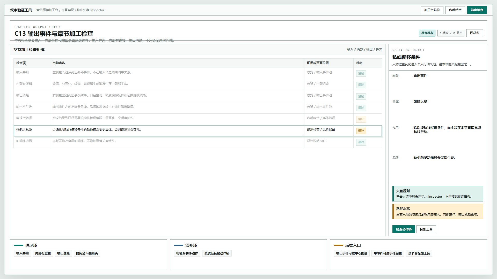

# 叙事验证工具 - 章节事件加工台交互实现原型 v15

## 元信息

- 版本：v15
- 生成时间：2026-06-21 20:20:40
- 状态：待用户确认
- 继承版本：v14 章节事件加工台效果图
- 目标画板：1920 x 1080
- 目标入口：`source/index.html`
- 页面主对象：章节函数 C13
- 设计说明：`../../设计说明/2026-06-21-章节事件加工台与对象编辑边界设计-v0.3.md`

## 本版定位

V15 把 V14 的静态评审图推进为可点击的验证性 HTML 原型。它仍然不修改全局时间线，只实现“章节事件加工台”的操作方式：

```text
并列输入事件池 -> 章节内部加工台 -> 输出事件池
```

本版新增的核心能力：

1. 单击输入事件、内部操作、输出事件或检查项，只选中对象，不直接跳转详情页。
2. 选中后显示对象摘要、类型、归属、作用和风险。
3. 同屏高亮与当前对象相关的输入、内部操作、输出或检查项。
4. 明确提供进入下一页的按钮，例如“查看加工路径”“检查边界”，避免误触跳转。

## 非目标

- 不修改全局时间线。
- 不向全局时间线添加事件关系箭头。
- 不实现真实保存、数据库或后端接口。
- 不实现完整事件详情页和章节函数编辑页，只验证入口逻辑。
- 不替代 v13 的中心事件图谱，也不替代事件对象编辑器。

## 共用事实源与设计依据

- 用户确认：全局时间线不要叠事件关系箭头。
- 用户确认：章节为中心的页面应是左侧输入、中间处理、右侧输出。
- 用户确认：章节接收的外部事件输入是并列输入，输入之间不画逻辑关系。
- 用户确认：章节内部组合才是带逻辑的“猪肚”部分。
- 用户确认：输出事件是章节产物，输出之间不在本页强连。
- 设计说明：`../../设计说明/2026-06-21-章节事件加工台与对象编辑边界设计-v0.3.md`。
- 历史原型：v14 章节事件加工台效果图。

## 画板规格与布局预算

- 截图视口：1920 x 1080。
- 顶栏：44px，用于视图切换。
- 页面头部：78px，用于说明当前对象和数量。
- 主体：三段式布局，左输入池、中加工台、右输出池。
- 底部：人物、地理、选中对象摘要。
- `#logic` 与 `#check` 页面保留右侧 Inspector。

## 图文证据链

### 01-交互加工台总览-1920x1080.png

- 评阅状态：待用户确认
- 设计依据：在 V14 三段式效果上加入选中对象摘要。默认选中“会议结果落地”，右侧输出池和底部摘要同步显示。
- 需要判断：底部选中对象摘要是否足够，不会抢占章节三段式主体。
- 允许偏差：选中对象默认值、卡片数量和摘要文字可调整。
- 不可接受偏差：输入事件之间出现因果线，或输出事件之间出现强连线。



### 02-内部组合交互态-1920x1080.png

- 评阅状态：待用户确认
- 设计依据：内部组合页默认选中“合流与冲突化”，右侧 Inspector 展示对象类型、归属、作用、风险。
- 需要判断：高亮路径是否能表达“相关对象”，而不是误读成输入池内的因果链。
- 允许偏差：内部节点名称可继续细化。
- 不可接受偏差：章节内部处理退化成一段摘要说明。



### 03-输出检查Inspector-1920x1080.png

- 评阅状态：待用户确认
- 设计依据：输出检查页默认选中“私线偏移条件”，用于验证选中检查对象后 Inspector 如何解释风险。
- 需要判断：检查矩阵是否适合作为章节对象编辑的校验面。
- 允许偏差：检查项可增减。
- 不可接受偏差：把章节检查混入单事件对象编辑器，导致对象边界不清。



## 原始材料说明

本版无外部原始图片。设计输入来自用户文字确认、v14 效果图和 v0.3 设计说明。

## 原型到实现映射

- `#overview`：章节事件加工台总览。
- `#logic`：章节内部组合逻辑。
- `#check`：章节输出与检查面板。
- 交互对象：`.event-card`、`.operation-node`、`.logic-node`、`.badge`、检查矩阵行。
- 交互状态：
  - `selected`：当前选中对象。
  - `related`：与当前对象相关。
  - `dimmed`：与当前对象无关。
- 数据模型：`objectModel`，临时写在 `source/index.html` 中，后续可拆为 JSON。

## 允许偏差与不可接受偏差

允许偏差：

- 卡片文案、节点命名和检查项数量可以继续改。
- Inspector 字段可以继续增减。
- 高亮关系可按真实数据模型重算。

不可接受偏差：

- 单击对象直接进入详情页。
- 输入事件池内部画因果线。
- 输出事件池内部画因果线。
- 在全局时间线上叠加事件关系箭头。
- 章节加工台和事件对象编辑器混成同一页面。

## 查看与再生成

打开：

```text
source/index.html#overview
source/index.html#logic
source/index.html#check
```

截图生成方式：

```powershell
$chrome='C:\Program Files\Google\Chrome\Application\chrome.exe'
$base=Resolve-Path '验证工具\原型包\2026-06-21-202040-叙事验证工具-章节事件加工台交互实现原型-v15'
$source=Join-Path $base 'source\index.html'
$url=([System.Uri](Resolve-Path $source).Path).AbsoluteUri
& $chrome --headless=new --disable-gpu --hide-scrollbars --window-size=1920,1080 --force-device-scale-factor=1 --virtual-time-budget=1200 --screenshot="$base\01-交互加工台总览-1920x1080.png" ($url + '#overview')
```

## 评审结论与后续处理

当前状态：待用户确认。

后续需要判断：

1. 点击对象后只选中和显示 Inspector 的交互是否符合预期。
2. 相关对象高亮是否过度，是否需要改成更克制的路径高亮。
3. 底部选中对象摘要是否保留，还是改成右侧可折叠 Inspector。
