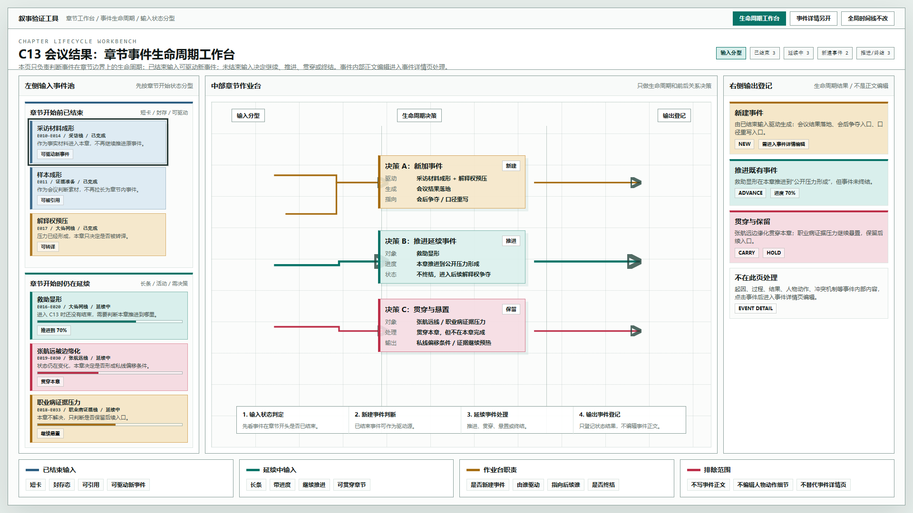

# 叙事验证工具 - 章节事件生命周期工作台原型 v16

## 元信息

- 版本：v16
- 生成时间：2026-06-21 21:58:28
- 状态：待用户确认
- 继承版本：v15 章节事件加工台交互实现原型
- 目标画板：1920 x 1080
- 目标入口：`source/index.html`
- 页面主对象：章节工作台 C13

## 本版定位

V16 收窄章节工作台的职责：它不再试图展示事件内部内容编辑，而是只处理事件在章节边界上的生命周期和前后关系。

本版强调两个输入类型：

1. 章节开始前已经结束的事件。
2. 章节开始时仍在延续的事件。

作业台只负责两类决策：

1. 是否新建事件：如果新建，要说明由哪些输入事件驱动，以及指向哪些后续事件。
2. 如何处理延续事件：继续推进、贯穿整章、悬置、还是终结。

## 非目标

- 不编辑事件正文内容。
- 不编辑人物动作、冲突机制、过程细节。
- 不替代事件详情页。
- 不修改全局时间线。
- 不引入全局事件关系箭头。

## 共用事实源与设计依据

- 用户确认：左侧输入事件池应明确区分“章节开始时已结束”和“章节开始时未结束”。
- 用户确认：章节作业台主要负责判断是否新加事件，以及如何处理尚未结束的事件。
- 用户确认：事件内部具体内容编辑应进入事件详情页，不放在章节工作台里。
- 历史原型：v15 章节事件加工台交互实现原型。

## 画板规格与布局预算

- 截图视口：1920 x 1080。
- 顶栏：44px。
- 对象栏：86px。
- 主体：三栏结构，左输入池、中作业台、右输出登记。
- 底部：视觉语义说明。

## 图文证据链

### 01-章节事件生命周期工作台-1920x1080.png

- 评阅状态：待用户确认
- 设计依据：左侧输入池先按章节开始状态分型；中部作业台只做生命周期和前后关系决策；右侧只登记生命周期结果。
- 需要判断：两类输入是否足够直观；“已结束”短卡和“延续中”长条是否能形成清晰视觉差异。
- 允许偏差：颜色、卡片数量、进度表达方式可继续调整。
- 不可接受偏差：把事件正文编辑放回章节工作台，或把已结束输入和延续中输入混在一起。



## 原始材料说明

本版无外部原始图片。设计输入来自用户对 v15 原型的反馈和本轮文字定义。

## 原型到实现映射

- `CompletedInputEvent`：章节开始前已经结束的输入事件。
- `ContinuingInputEvent`：章节开始时仍在延续的输入事件。
- `ChapterLifecycleDecision`：章节作业台中的生命周期决策。
- `ChapterOutputRegistry`：输出登记区，只记录新建、推进、贯穿、悬置、终结等状态结果。

## 允许偏差与不可接受偏差

允许偏差：

- 已结束输入和延续中输入的颜色可以继续调整。
- 进度条可以替换为跨度条、章节覆盖条或状态图标。
- 决策卡可以继续细分为“新建”“推进”“终结”“悬置”四类。

不可接受偏差：

- 左侧不区分输入事件的章节开始状态。
- 作业台承担事件内部正文编辑。
- 输出区把结果写成正文摘要，而不是生命周期登记。
- 本页继续修改全局时间线。

## 查看与再生成

打开：

```text
source/index.html
```

截图生成方式：

```powershell
$chrome='C:\Program Files\Google\Chrome\Application\chrome.exe'
$base=Resolve-Path '验证工具\原型包\2026-06-21-215828-叙事验证工具-章节事件生命周期工作台原型-v16'
$source=Join-Path $base 'source\index.html'
$url=([System.Uri](Resolve-Path $source).Path).AbsoluteUri
& $chrome --headless=new --disable-gpu --hide-scrollbars --window-size=1920,1080 --force-device-scale-factor=1 --virtual-time-budget=1200 --screenshot="$base\01-章节事件生命周期工作台-1920x1080.png" $url
```

## 评审结论与后续处理

当前状态：待用户确认。

后续需要判断：

1. “已结束输入”和“延续中输入”的视觉分型是否成立。
2. 作业台是否只保留生命周期和前后关系决策。
3. 右侧输出登记是否足以表达章节产物，而不混入事件详情编辑。
