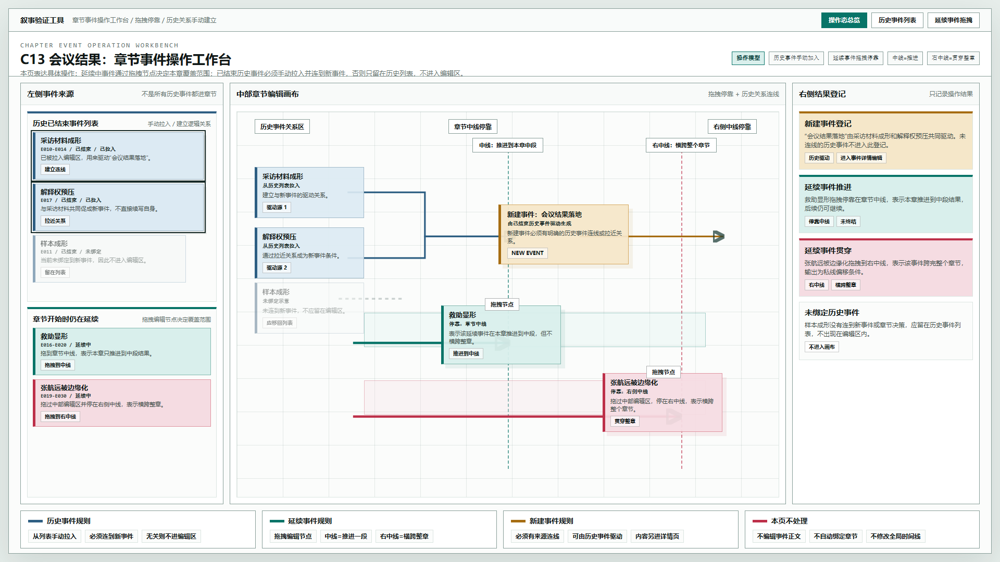

# 叙事验证工具 - 章节事件操作工作台原型 v17

## 元信息

- 版本：v17
- 生成时间：2026-06-21 22:39:14
- 状态：待用户确认
- 继承版本：v16 章节事件生命周期工作台原型
- 目标画板：1920 x 1080
- 目标入口：`source/index.html`
- 页面主对象：章节事件操作工作台 C13

## 本版定位

V17 修正 V16 只做“状态分类”但没有表达“具体操作”的问题。本版重点验证两个操作模型：

1. 延续中事件的拖拽停靠逻辑。
2. 已结束历史事件的手动加入与关系建立逻辑。

## 核心操作定义

### 1. 延续中事件拖拽

- 延续中事件提供一个可拖拽编辑节点。
- 节点拖到章节中线，表示事件在本章推进到中段结果，但不横跨整章。
- 节点拖过中部编辑区并停在右侧中线，表示事件横跨整个章节。

### 2. 历史已结束事件手动加入

- 已结束事件先存在于历史事件列表。
- 只有被手动拉入并建立关系的历史事件，才进入章节编辑画布。
- 拉入的目的不是续写历史事件本身，而是让它驱动新事件或和新事件建立逻辑关系。
- 与新事件无关的历史事件应留在历史列表，不进入左侧或右侧编辑区。

## 非目标

- 不编辑事件正文。
- 不自动把历史事件绑定到当前章节。
- 不修改全局时间线。
- 不实现真实拖拽代码，只表达拖拽后的关键停靠状态。

## 共用事实源与设计依据

- 用户确认：章节开始时仍在延续的事件需要拖拽编辑节点。
- 用户确认：拖到中线表示推进到该位置；拖到右侧中线表示横跨整章。
- 用户确认：已结束历史事件需要从列表中手动加入，目的是建立与当前章节或新事件的逻辑关系。
- 用户确认：如果历史事件与新事件无关，不应出现在编辑区内。
- 历史原型：v16 章节事件生命周期工作台原型。

## 画板规格与布局预算

- 截图视口：1920 x 1080。
- 顶栏：44px。
- 对象栏：86px。
- 主体：三栏结构，左事件来源、中章节编辑画布、右结果登记。
- 底部：四组操作规则。

## 图文证据链

### 01-章节事件操作工作台-拖拽与历史关系-1920x1080.png

- 评阅状态：待用户确认
- 设计依据：用一张图同时表达历史事件手动建立关系和延续事件拖拽停靠。
- 需要判断：中线和右中线的停靠含义是否足够直观。
- 允许偏差：节点位置、颜色、连线样式可以继续调整。
- 不可接受偏差：历史事件默认进入章节；延续事件只显示状态而不提供拖拽停靠语义。



## 原始材料说明

本版无外部原始图片。设计输入来自用户对 v16 的反馈和本轮文字定义。

## 原型到实现映射

- `HistoryEventList`：历史已结束事件列表。
- `LinkedHistoryEventNode`：已拉入编辑画布并建立关系的历史事件节点。
- `UnlinkedHistoryEvent`：未绑定历史事件，应留在列表中。
- `ContinuingEventDragNode`：延续中事件的拖拽编辑节点。
- `ChapterMiddleDock`：章节中线停靠点，表示推进到本章中段。
- `ChapterRightDock`：右侧中线停靠点，表示横跨整个章节。
- `NewEventNode`：由历史事件关系驱动生成的新事件节点。

## 允许偏差与不可接受偏差

允许偏差：

- 中线和右中线可以改成更明显的吸附轨道。
- 历史事件可以从左侧列表拖入，也可以通过“加入关系”按钮进入画布。
- 结果登记可以后续拆成更细的输出对象。

不可接受偏差：

- 历史事件不经手动建立关系就默认进入章节。
- 延续事件没有可操作的拖拽节点。
- 拖到中线和拖到右中线没有明确语义差异。
- 本页承担事件详情编辑。

## 查看与再生成

打开：

```text
source/index.html
```

截图生成方式：

```powershell
$chrome='C:\Program Files\Google\Chrome\Application\chrome.exe'
$base=Resolve-Path '验证工具\原型包\2026-06-21-223914-叙事验证工具-章节事件操作工作台原型-v17'
$source=Join-Path $base 'source\index.html'
$url=([System.Uri](Resolve-Path $source).Path).AbsoluteUri
& $chrome --headless=new --disable-gpu --hide-scrollbars --window-size=1920,1080 --force-device-scale-factor=1 --virtual-time-budget=1200 --screenshot="$base\01-章节事件操作工作台-拖拽与历史关系-1920x1080.png" $url
```

## 评审结论与后续处理

当前状态：待用户确认。

后续需要判断：

1. 延续中事件的拖拽停靠是否符合预期。
2. 历史事件列表与编辑画布的边界是否清楚。
3. 新建事件必须有历史来源连线这一规则是否需要强化。
