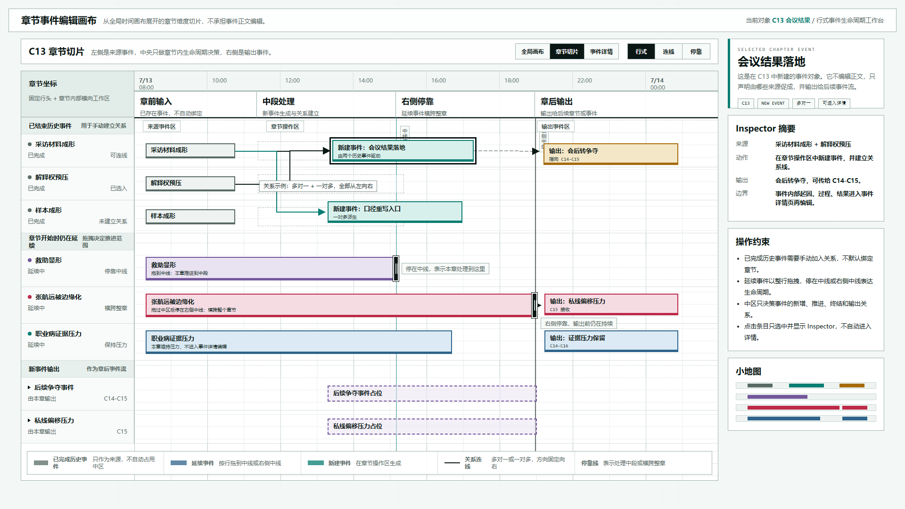

# 叙事验证工具：行式章节编辑画布原型 v18

## 元信息

- 版本：v18
- 生成时间：2026-06-21 22:52:51
- 状态：待用户确认
- 目标画板：1920 x 1080
- 原型入口：`source/index.html`
- 评审图：`01-行式章节编辑画布-1920x1080.png`
- 页面主对象：从全局时间画布展开的 `C13 会议结果` 章节切片

## 本版定位

本版不继续沿用 v15-v17 的章节编辑原型结构，而是回到已被认为更有意义的“全局时间画布”视觉语言。章节编辑视图被定义为全局时间画布中“章节维度”的扩充和细化。

核心表达：

1. 章节编辑仍然是行式画布，而不是自由漂浮节点图。
2. 左侧行头保留事件来源和生命周期状态。
3. 中央只处理章节内的事件生命周期决策：新增、推进、横跨、输出。
4. 已结束历史事件只作为来源候选，不自动占用中区。
5. 章节开始时仍在延续的事件，可以按行拖到中线或右侧中线。
6. 新建事件在中区生成后，再与左侧历史事件建立关系线。

## 非目标

- 不设计事件详情页的起因、过程、结果编辑。
- 不修改全局时间画布原型。
- 不把历史事件默认绑定到章节。
- 不使用全局时间线上的跨章节箭头关系，以免破坏全局画布的清晰度。

## 设计依据

- 用户明确要求：当前章节编辑视图应参考“全局时间画布”，因为它是全局时间画布里章节维度的扩充和细化。
- 用户明确要求：不要继续在上一版不合适的章节编辑原型上修改，应基于更明确需求重绘。
- 用户明确要求：理想操作效果是一行一行的；未结束历史事件从左侧拉到中间或右侧；已结束历史事件占一行，但中间操作区域为空。
- 用户明确要求：在中间操作空区建立新事件，然后与左侧已完成事件连线，连接方式可以多对一或一对多。
- 已有视觉基准：`2026-06-20-叙事验证工具-真实时间轴底盘原型-v9/01-真实时间轴总览-1920x1080.png`。

## 图文证据

### 01-行式章节编辑画布-1920x1080.png



评阅状态：待用户确认。

设计要点：

- 顶部保留真实时间轴与章节坐标的双层结构，但本图以章节操作区为主。
- 左侧行头区区分“已结束历史事件”和“章节开始时仍在延续”两类输入。
- 已结束历史事件在中区显示空槽，表示它们不会自动进入章节处理逻辑。
- 新建事件在中区生成，并通过规整的左到右折线与历史事件建立关系。
- 延续事件以横向条表示生命周期，拖到中线代表本章推进到中段，拖到右侧中线代表横跨整章。
- 右侧 Inspector 只显示选中对象摘要和确认操作，不替代事件详情页。

需要用户判断的问题：

- 这种“已完成事件空槽 + 新建事件连线”的表达是否足够直观。
- 延续事件的中线停靠和右侧停靠是否符合预期操作语义。
- 右侧 Inspector 的摘要层级是否足够，不会让用户误以为这里要编辑事件正文。

## 原始材料说明

本版无外部原始图片。参考对象是项目内部已生成的 v9 全局时间画布评审图。

## 原型到实现映射

- 目标页面：章节事件编辑画布。
- 页面归属：叙事验证工具。
- 主对象：章节切片，示例为 `C13 会议结果`。
- 核心组件：
  - 固定行头轨道
  - 章节内部横向操作区
  - 关系连线层
  - 延续事件拖拽停靠层
  - 右侧 Inspector
- 数据来源：
  - 章节元信息
  - 历史已完成事件列表
  - 章节开始时仍在延续的事件列表
  - 新建事件及输出事件关系
- 实现验收：
  - 截图应保持 1920 x 1080。
  - 画布应保留全局时间画布的密度和横向坐标感。
  - 已完成事件、延续事件、新建事件必须能被一眼区分。
  - 关系线必须从左向右，不能出现跨画布乱连线。

## 允许偏差与不可接受偏差

允许偏差：

- 颜色亮度、字体渲染、线宽可在实现中微调。
- 事件名与示例数据可替换为真实数据。
- 关系线可根据真实布局自动避让。

不可接受偏差：

- 把章节编辑重新改成自由节点图。
- 让已完成历史事件自动进入章节处理中区。
- 点击事件后直接跳详情，绕过 Inspector。
- 让全局时间画布承担事件关系箭头。
- 模糊“已结束历史事件”和“仍在延续事件”的操作差异。

## 查看与再生成

打开 HTML：

```powershell
Start-Process 'C:\OpenCodeWorkSpace\TestProject\文章重写\验证工具\原型包\2026-06-21-225251-叙事验证工具-行式章节编辑画布原型-v18\source\index.html'
```

重新生成截图：

```powershell
$chrome = 'C:\Program Files\Google\Chrome\Application\chrome.exe'
$base = 'C:\OpenCodeWorkSpace\TestProject\文章重写\验证工具\原型包\2026-06-21-225251-叙事验证工具-行式章节编辑画布原型-v18'
$source = Join-Path $base 'source\index.html'
$out = Join-Path $base '01-行式章节编辑画布-1920x1080.png'
$url = ([System.Uri](Resolve-Path $source).Path).AbsoluteUri
$profile = Join-Path $env:TEMP 'codex-v18-chapter-canvas-profile'
Remove-Item -Recurse -Force $profile -ErrorAction SilentlyContinue
& $chrome --headless=new --disable-gpu --hide-scrollbars --window-size=1920,1080 --force-device-scale-factor=1 --virtual-time-budget=1200 --user-data-dir=$profile --screenshot=$out $url
```

## 评审结论

待用户确认。若本版方向成立，下一步可以把“拖拽停靠”“新建事件”“连线关系”“Inspector 确认进入详情”拆成交互状态图或实现验证程序。
