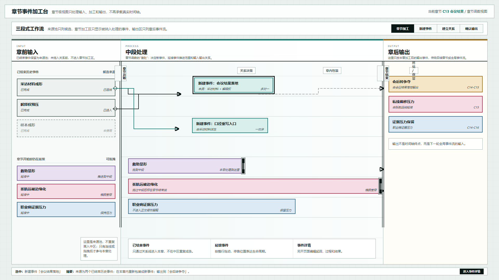

# 叙事验证工具：三段式章节加工台原型 v19

## 元信息

- 版本：v19
- 生成时间：2026-06-21 23:12:58
- 状态：待用户确认
- 目标画板：1920 x 1080
- 原型入口：`source/index.html`
- 评审图：`01-三段式章节加工台-1920x1080.png`
- 页面主对象：章节级事件加工视图，示例为 `C13 会议结果`

## 本版定位

本版继承 v18 的“章节视图是全局时间画布中章节维度扩充”的方向，但删除章节页中不必要的时间轴语义。章节页不再承担真实日期、缩放、时间拖拽等全局能力，而是聚焦为三段式章节函数：

`章前输入 -> 中段处理 -> 章后输出`

## 本轮关键调整

1. 删除真实时间轴及其相关交互表现。
2. 删除密集纵横网格，只保留章节开始与章节结束的双线边界。
3. 将“章前输入 / 中段处理 / 章后输出”做成明确的左中右三段。
4. 将已结束历史事件改为“来源池”，不再在中区重复画同名条目。
5. 延续事件仍按行拖入中段处理区，用停靠位置表达推进到中段或横跨整章。
6. Inspector 从右侧主栏降级到底部摘要条，避免干扰右侧输出区。

## 非目标

- 不修改全局时间画布。
- 不表现真实日期、缩放比例或时间拖拽。
- 不在章节页编辑事件正文。
- 不把已结束历史事件默认绑定到章节。

## 设计依据

- 用户确认 v18 大方向可用，但指出章节层视图不应再保留时间轴能力。
- 用户指出“章前输入 / 中段处理 / 章后输出”的区分度不够，应明确做成左、中、右三段。
- 用户指出中间编辑区的横纵轴过密，章节视图只需要章节开始和结束位置，不需要严格日期对应。
- 用户指出左侧已列出的历史事件不应在章节输入区重复出现。

## 图文证据

### 01-三段式章节加工台-1920x1080.png



评阅状态：待用户确认。

设计要点：

- 左侧是事件来源池，已结束历史事件以候选卡片形式存在。
- 中间是章节加工区，只显示被纳入本章处理的事件和延续事件。
- 右侧是输出事件流，替代原右侧 Inspector 主栏。
- 章节开始和章节结束用双线表示，弱化时间轴，强化章节边界。
- 关系线从左侧来源池进入中区新建事件，不再画重复输入条。
- 底部只保留当前选中对象摘要和“进入事件详情”入口。

## 原始材料说明

本版无外部原始图片。设计参考来自 v18 评审后的用户反馈与此前全局时间画布视觉基准。

## 原型到实现映射

- 目标页面：章节事件加工台。
- 页面归属：叙事验证工具。
- 主对象：章节函数，示例为 `C13 会议结果`。
- 核心组件：
  - 事件来源池
  - 章节加工区
  - 输出事件流
  - 关系连线层
  - 章节开始 / 章节结束双线边界
  - 底部选中摘要条
- 实现验收：
  - 画面必须是明确三段结构。
  - 已结束历史事件不得在中区重复出现。
  - 中区不得出现真实时间轴、日期刻度或密集网格。
  - 延续事件的拖拽停靠语义必须能一眼区分。

## 允许偏差与不可接受偏差

允许偏差：

- 颜色、线宽和行距可在实现中微调。
- 示例事件名称可替换为真实数据。
- 关系线可在真实实现中自动避让。

不可接受偏差：

- 重新把章节页做成时间轴或甘特图。
- 在中区重复画左侧已结束历史事件。
- 让右侧 Inspector 挤占输出区。
- 去掉章节开始和章节结束边界。
- 将事件详情编辑塞回章节加工台。

## 查看与再生成

打开 HTML：

```powershell
Start-Process 'C:\OpenCodeWorkSpace\TestProject\文章重写\验证工具\原型包\2026-06-21-231258-叙事验证工具-三段式章节加工台原型-v19\source\index.html'
```

重新生成截图：

```powershell
$chrome = 'C:\Program Files\Google\Chrome\Application\chrome.exe'
$base = 'C:\OpenCodeWorkSpace\TestProject\文章重写\验证工具\原型包\2026-06-21-231258-叙事验证工具-三段式章节加工台原型-v19'
$source = Join-Path $base 'source\index.html'
$out = Join-Path $base '01-三段式章节加工台-1920x1080.png'
$url = ([System.Uri](Resolve-Path $source).Path).AbsoluteUri
$profile = Join-Path $env:TEMP 'codex-v19-chapter-workbench-profile'
Remove-Item -Recurse -Force $profile -ErrorAction SilentlyContinue
& $chrome --headless=new --disable-gpu --hide-scrollbars --window-size=1920,1080 --force-device-scale-factor=1 --virtual-time-budget=1200 --user-data-dir=$profile --screenshot=$out $url
```

## 评审结论

待用户确认。若方向成立，下一步可以补一张交互状态图：从来源池拖入、建立关系线、延续事件停靠、确认输出。
