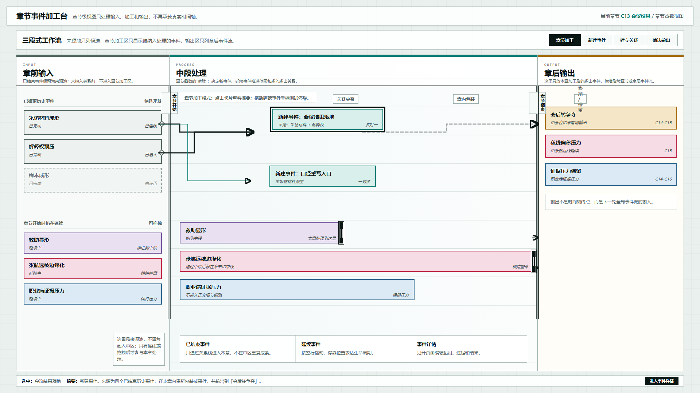
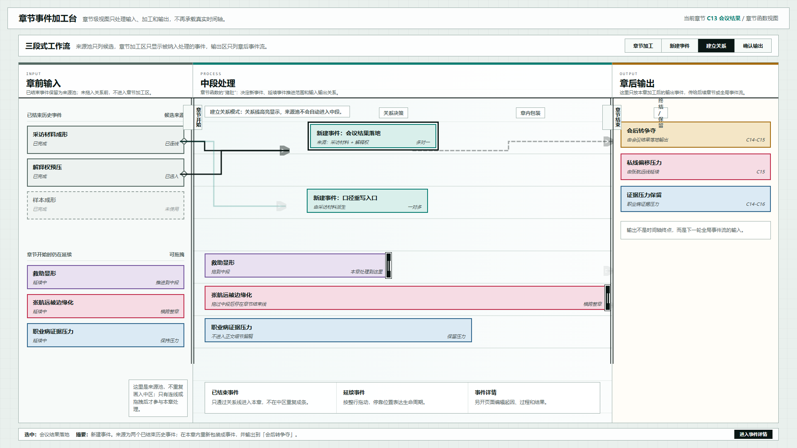
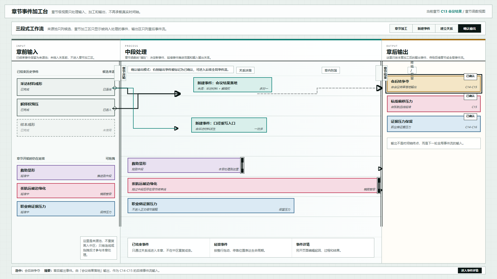

# 叙事验证工具：三段式章节加工台交互原型 v20

## 元信息

- 版本：v20
- 生成时间：2026-06-21 23:20:10
- 状态：待用户确认
- 目标画板：1920 x 1080
- 原型入口：`source/index.html`
- 评审图：
  - `01-交互默认态-1920x1080.png`
  - `02-关系模式-1920x1080.png`
  - `03-输出确认态-1920x1080.png`
- 页面主对象：章节级事件加工视图，示例为 `C13 会议结果`

## 本版定位

本版基于 v19 的三段式界面制作一版可操作 HTML 原型。它不改变 v19 的主要视觉结构，只验证这个界面在真实使用时能否被点选、确认和理解。

核心交互：

1. 点击来源池、加工区或输出区中的事件卡片，底部摘要实时更新。
2. 点击顶部模式按钮，切换章节加工、新建事件、建立关系、确认输出。
3. 进入“建立关系”模式时，关系线高亮，强调已结束历史事件通过关系线进入本章。
4. 进入“确认输出”模式时，右侧输出事件标记为已确认。
5. 拖动延续事件右侧黑色手柄，可以模拟中段停靠或章节结束停靠。
6. 点击“进入事件详情”只显示提示，不自动跳转，保持“确认后进入”的原则。

## 非目标

- 不实现真实数据存储。
- 不实现事件详情页。
- 不实现完整拖拽建线算法。
- 不重新引入真实时间轴、日期刻度或缩放控件。

## 设计依据

- 用户确认 v19 界面方向可作为一版制作基础。
- 用户此前要求章节层视图聚焦输入、加工和输出，不再承担全局时间轴能力。
- 用户此前要求已结束历史事件保留为来源池，不在中区重复出现。
- 用户此前要求点击对象后先显示 Inspector 或摘要，不应误触后直接进入详情。

## 图文证据

### 01-交互默认态-1920x1080.png



默认选中「会议结果落地」。画面保留 v19 三段式结构，底部摘要条显示当前选中对象。

### 02-关系模式-1920x1080.png



顶部切换到“建立关系”模式，关系线高亮。该图用于验证“已结束历史事件通过关系线进入本章，而不是重复画入中区”。

### 03-输出确认态-1920x1080.png



顶部切换到“确认输出”模式，右侧输出事件显示确认标记。该图用于验证输出区独立于 Inspector，承接章后事件流。

## 原型到实现映射

- 目标页面：章节事件加工台。
- 页面归属：叙事验证工具。
- 主对象：章节函数，示例为 `C13 会议结果`。
- 核心组件：
  - 来源池
  - 章节加工区
  - 输出事件流
  - 关系连线层
  - 底部选中摘要条
  - 延续事件停靠手柄
- 后续实现重点：
  - 事件对象选中状态
  - 来源关系的多对一、一对多表达
  - 延续事件的生命周期停靠
  - 输出确认后进入全局事件流

## 查看与再生成

打开 HTML：

```powershell
Start-Process 'C:\OpenCodeWorkSpace\TestProject\文章重写\验证工具\原型包\2026-06-21-232010-叙事验证工具-三段式章节加工台交互原型-v20\source\index.html'
```

重新生成截图：

```powershell
$chrome = 'C:\Program Files\Google\Chrome\Application\chrome.exe'
$base = 'C:\OpenCodeWorkSpace\TestProject\文章重写\验证工具\原型包\2026-06-21-232010-叙事验证工具-三段式章节加工台交互原型-v20'
$source = Join-Path $base 'source\index.html'
$profile = Join-Path $env:TEMP 'codex-v20-chapter-workbench-profile'
Remove-Item -Recurse -Force $profile -ErrorAction SilentlyContinue
$url = ([System.Uri](Resolve-Path $source).Path).AbsoluteUri
& $chrome --headless=new --disable-gpu --hide-scrollbars --window-size=1920,1080 --force-device-scale-factor=1 --virtual-time-budget=1200 --user-data-dir=$profile --screenshot=(Join-Path $base '01-交互默认态-1920x1080.png') $url
& $chrome --headless=new --disable-gpu --hide-scrollbars --window-size=1920,1080 --force-device-scale-factor=1 --virtual-time-budget=1200 --user-data-dir=$profile --screenshot=(Join-Path $base '02-关系模式-1920x1080.png') "$url#relations"
& $chrome --headless=new --disable-gpu --hide-scrollbars --window-size=1920,1080 --force-device-scale-factor=1 --virtual-time-budget=1200 --user-data-dir=$profile --screenshot=(Join-Path $base '03-输出确认态-1920x1080.png') "$url#output"
```

## 评审结论

待用户确认。若本版方向成立，下一步可以把它从静态 HTML 原型推进为更真实的数据模型原型：事件对象、章节对象、关系对象和输出对象分开存储。
