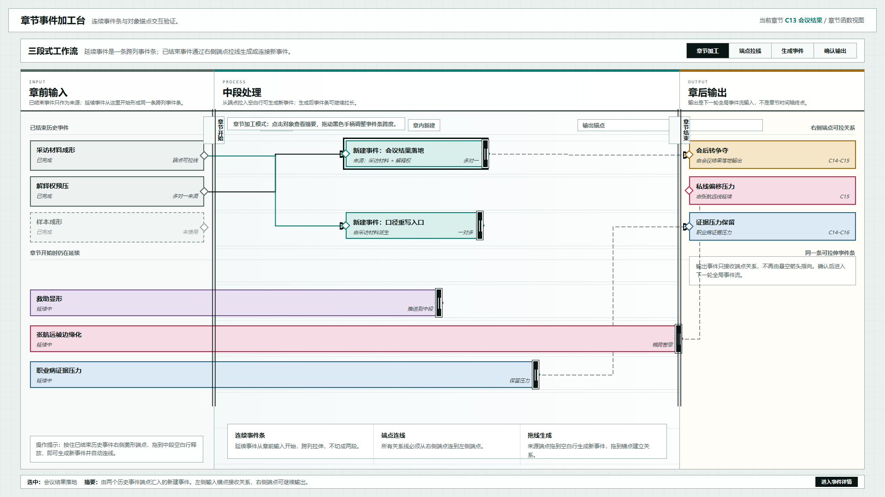
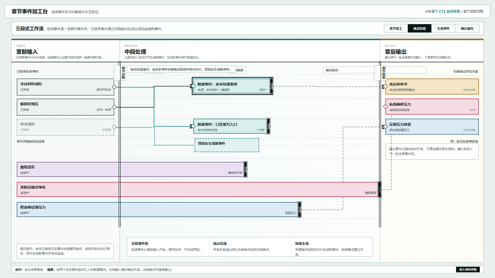
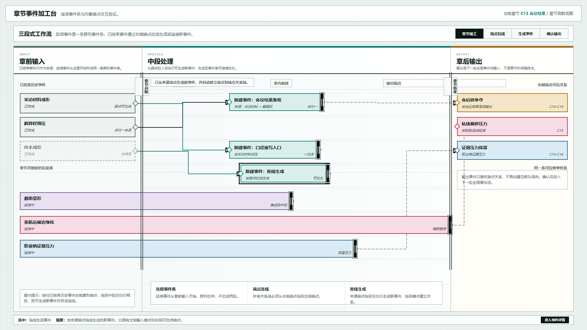

# 叙事验证工具：连续事件条与锚点交互原型 v21

## 元信息

- 版本：v21
- 生成时间：2026-06-21 23:47:22
- 状态：待用户确认
- 目标画板：1920 x 1080
- 原型入口：`source/index.html`
- 关联设计说明：`../../设计说明/2026-06-21-章节事件加工台对象锚点与连续事件条设计-v0.4.md`
- 评审图：
  - `01-端点关系与连续事件条-1920x1080.png`
  - `02-端点拖线生成事件-1920x1080.png`
  - `03-拖线生成后状态-1920x1080.png`

## 本版定位

本版修正 v20 暴露的两个对象模型问题：

1. 延续事件不能被切成左侧一段和中区一段，必须是同一条跨列事件条。
2. 历史事件到新建事件的关系线必须连接对象端点，不能再画悬空折线。

## 核心交互

- 已结束历史事件右侧有关系端点。
- 从端点拖出辅助线，释放到中段空白行会新建事件。
- 释放到已有事件左侧锚点会建立关系。
- 新建事件和延续事件都可以通过右侧黑色手柄拉长。
- 延续事件从章前输入列开始，跨列延展到中段、章节结束或输出区。

## 非目标

- 不实现持久化保存。
- 不实现完整事件详情页。
- 不实现复杂自动排线。
- 不恢复章节页中的真实时间轴。

## 图文证据

### 01-端点关系与连续事件条-1920x1080.png



默认态。可检查两点：

- 延续事件是从章前输入开始的同一条跨列事件条。
- 已结束历史事件到新建事件的关系线连接端点。

### 02-端点拖线生成事件-1920x1080.png



端点拖线演示态。展示从历史事件右侧端点拖出辅助线，释放到中段空白行后可生成新事件。

### 03-拖线生成后状态-1920x1080.png



拖线生成后状态。中段新增事件拥有左侧输入锚点和右侧拉伸端点，并自动建立来源关系线。

## 原型到实现映射

- 目标页面：章节事件加工台。
- 主对象：章节函数，示例为 `C13 会议结果`。
- 核心组件：
  - 已结束历史事件来源卡
  - 连续延续事件条
  - 章内新建事件条
  - 端点锚点
  - SVG 关系线层
  - 事件条拉伸手柄

## 查看与再生成

打开 HTML：

```powershell
Start-Process 'C:\OpenCodeWorkSpace\TestProject\文章重写\验证工具\原型包\2026-06-21-234722-叙事验证工具-连续事件条与锚点交互原型-v21\source\index.html'
```

重新生成截图：

```powershell
$chrome = 'C:\Program Files\Google\Chrome\Application\chrome.exe'
$base = 'C:\OpenCodeWorkSpace\TestProject\文章重写\验证工具\原型包\2026-06-21-234722-叙事验证工具-连续事件条与锚点交互原型-v21'
$source = Join-Path $base 'source\index.html'
$profile = Join-Path $env:TEMP 'codex-v21-anchor-workbench-profile'
Remove-Item -Recurse -Force $profile -ErrorAction SilentlyContinue
$url = ([System.Uri](Resolve-Path $source).Path).AbsoluteUri
& $chrome --headless=new --disable-gpu --hide-scrollbars --window-size=1920,1080 --force-device-scale-factor=1 --virtual-time-budget=1400 --user-data-dir=$profile --screenshot=(Join-Path $base '01-端点关系与连续事件条-1920x1080.png') $url
& $chrome --headless=new --disable-gpu --hide-scrollbars --window-size=1920,1080 --force-device-scale-factor=1 --virtual-time-budget=1400 --user-data-dir=$profile --screenshot=(Join-Path $base '02-端点拖线生成事件-1920x1080.png') "$url#drag"
& $chrome --headless=new --disable-gpu --hide-scrollbars --window-size=1920,1080 --force-device-scale-factor=1 --virtual-time-budget=1400 --user-data-dir=$profile --screenshot=(Join-Path $base '03-拖线生成后状态-1920x1080.png') "$url#created"
```

## 评审结论

待用户确认。重点请检查：连续事件条是否符合预期、端点连线是否足够准确、拖线生成事件的交互是否能支撑后续实现。
