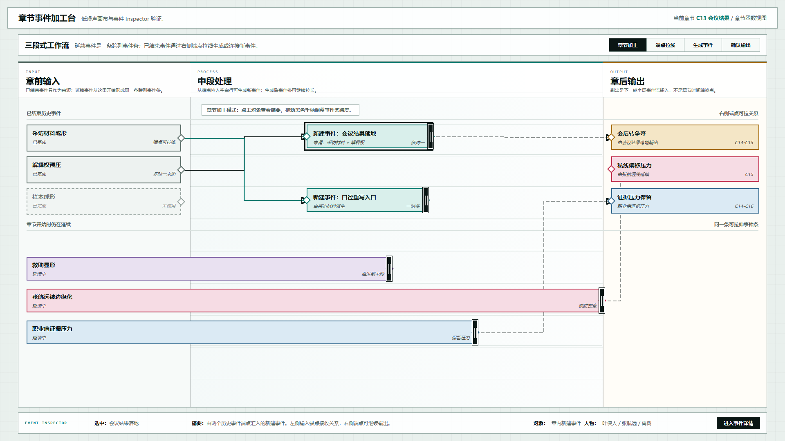
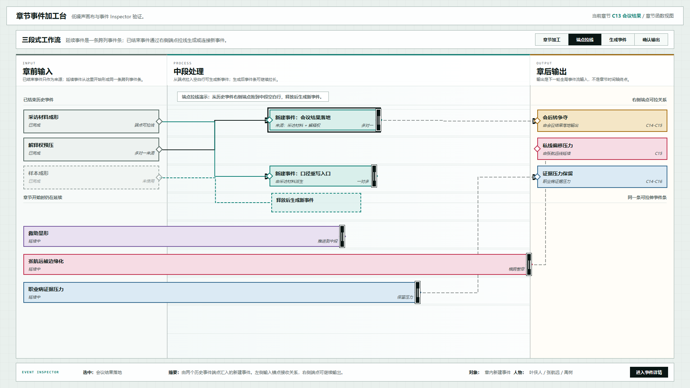
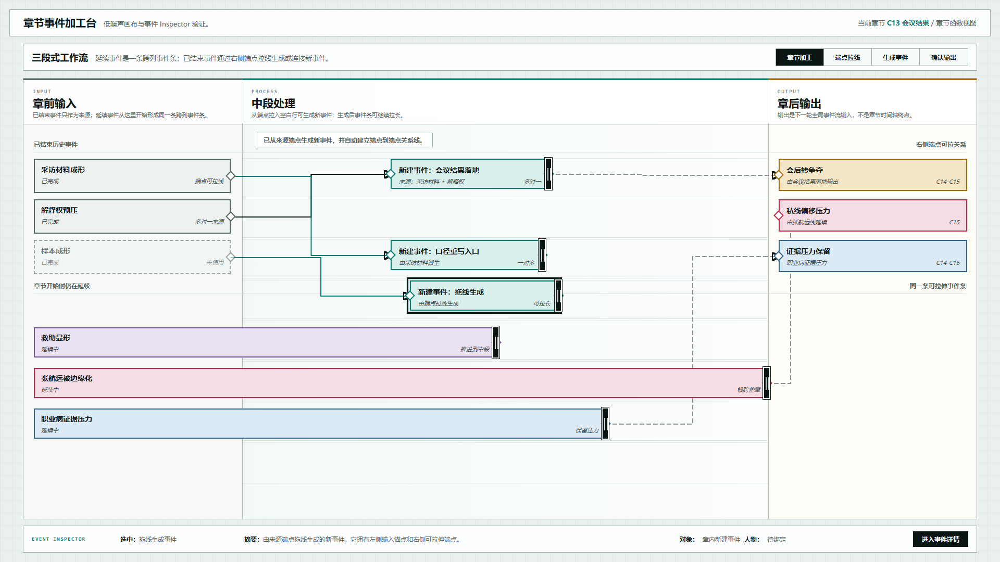

# 叙事验证工具：低噪声章节加工台与事件 Inspector 原型 v22

## 元信息

- 版本：v22
- 生成时间：2026-06-22 00:05:13
- 状态：待用户确认
- 目标画板：1920 x 1080
- 原型入口：`source/index.html`
- 继承版本：v21 连续事件条与锚点交互原型
- 关联设计说明：`../../设计说明/2026-06-22-章节加工台低噪声显示与事件Inspector设计-v0.5.md`
- 评审图：
  - `01-低噪声章节加工台-1920x1080.png`
  - `02-端点拖线预览-1920x1080.png`
  - `03-拖线生成与Inspector-1920x1080.png`

## 本版定位

本版不重做章节加工台的对象模型，只处理 v21 评审中暴露的两类问题：

1. 降低画布噪声：弱化章节边界，隐藏教学说明、底部规则条和悬浮标牌。
2. 补齐事件 Inspector：选中事件后在稳定 Inspector 中查看摘要，并通过显式按钮进入事件详情。

## 非目标

- 不改变连续事件条模型。
- 不改变端点到端点连线模型。
- 不展开完整事件详情页。
- 不实现持久化保存。

## 图文证据

### 01-低噪声章节加工台-1920x1080.png



默认态。用于检查：

- 不再显示章节开始/结束竖排标牌和双黑线。
- 不再显示底部教学规则条。
- Inspector 作为底部稳定入口显示当前选中事件。

### 02-端点拖线预览-1920x1080.png



端点拖线预览态。用于检查来源事件右侧锚点拖线时，辅助线是否从端点出发并指向中段空白行。

### 03-拖线生成与Inspector-1920x1080.png



拖线生成后状态。用于检查新建事件是否进入独立行、是否自动建立来源关系，以及 Inspector 是否同步显示新建事件并保留“进入事件详情”按钮。

## 原型到实现映射

- 目标页面：章节事件加工台。
- 主对象：章节函数，示例为 `C13 会议结果`。
- 核心组件：
  - 已结束历史事件来源卡
  - 连续延续事件条
  - 章内新建事件条
  - 章后输出事件卡
  - 端点锚点
  - SVG 关系线层
  - 事件 Inspector

## 允许偏差与不可接受偏差

允许偏差：

- 颜色明度、行间距、按钮尺寸可继续微调。
- Inspector 将来可以从底部条升级为右侧抽屉或浮层。

不可接受偏差：

- 点击事件后直接跳转详情页。
- 连续事件再次被拆成左右两段。
- 关系线不连接端点。
- 教学说明重新常驻挤占画布主体。

## 查看与再生成

打开 HTML：

```powershell
Start-Process 'C:\OpenCodeWorkSpace\TestProject\文章重写\验证工具\原型包\2026-06-22-000513-叙事验证工具-低噪声章节加工台与事件Inspector原型-v22\source\index.html'
```

截图使用 Chrome Headless，视口固定为 `1920 x 1080`。
