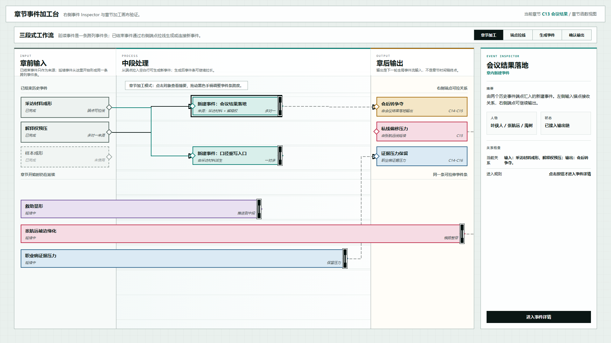
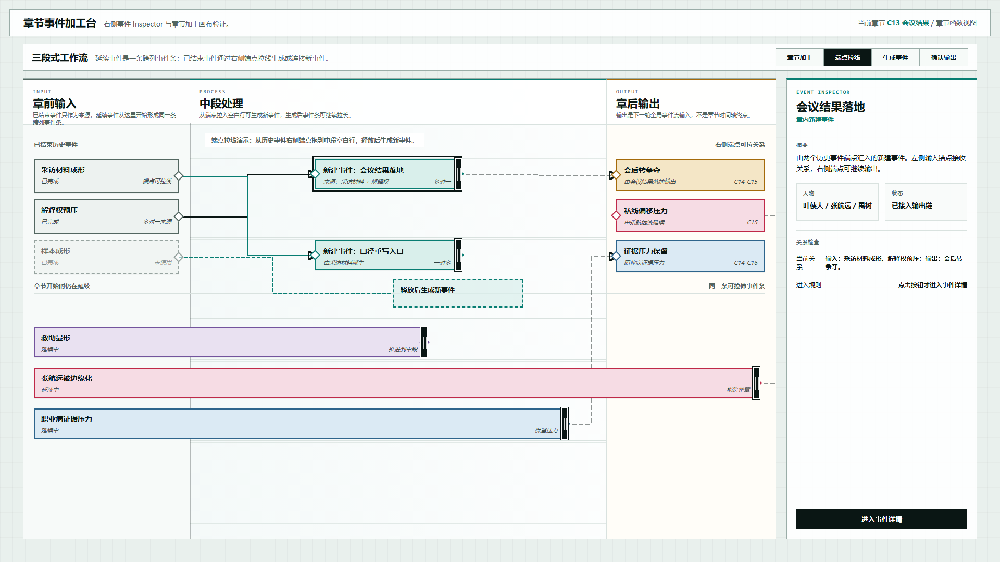
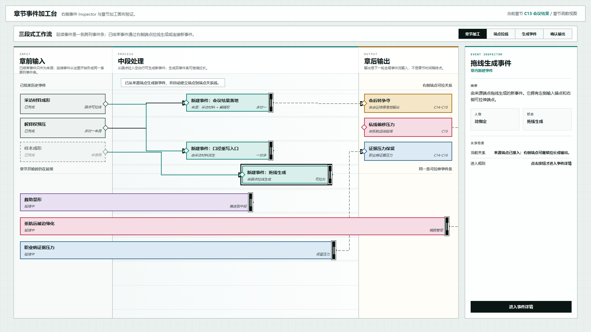

# 叙事验证工具：右侧事件 Inspector 章节加工台原型 v23

## 元信息

- 版本：v23
- 生成时间：2026-06-22 00:16:12
- 状态：待用户确认
- 目标画板：1920 x 1080
- 原型入口：`source/index.html`
- 继承版本：v22 低噪声章节加工台与事件 Inspector 原型
- 关联设计说明：`../../设计说明/2026-06-22-章节加工台右侧事件Inspector布局设计-v0.6.md`
- 评审图：
  - `01-右侧Inspector章节加工台-1920x1080.png`
  - `02-端点拖线右侧Inspector-1920x1080.png`
  - `03-拖线生成右侧Inspector-1920x1080.png`

## 本版定位

本版只处理一个核心布局决策：Inspector 不再放在底部，而是作为右侧固定检查区，占用页面约 20% 的横向空间。

左侧章节加工画布被横向压缩，但仍保持三段：

- 章前输入。
- 中段处理。
- 章后输出。

连续事件条、端点锚点和端点到端点连线逻辑沿用 v21/v22。

## 非目标

- 不展开完整事件详情页。
- 不改变章节加工台的事件生命周期模型。
- 不重做全局时间线。
- 不实现持久化保存。

## 图文证据

### 01-右侧Inspector章节加工台-1920x1080.png



默认态。用于检查：

- Inspector 是否稳定放在右侧。
- 画布横向压缩后，章前 / 中段 / 章后三段是否仍然可读。
- 选中事件后右侧是否显示摘要、人物、状态和关系检查。

### 02-端点拖线右侧Inspector-1920x1080.png



端点拖线预览态。用于检查拖线状态下，右侧 Inspector 是否不遮挡画布、不取代端点交互。

### 03-拖线生成右侧Inspector-1920x1080.png



拖线生成后状态。用于检查新建事件是否被自动选中，右侧 Inspector 是否同步更新为新建事件。

## 原型到实现映射

- 目标页面：章节事件加工台。
- 主对象：章节函数，示例为 `C13 会议结果`。
- 核心组件：
  - 已结束历史事件来源卡
  - 连续延续事件条
  - 章内新建事件条
  - 章后输出事件卡
  - 端点锚点
  - SVG 关系线层
  - 右侧事件 Inspector

## 允许偏差与不可接受偏差

允许偏差：

- 右侧 Inspector 宽度可以在 18% 到 24% 之间微调。
- 画布三段比例可以继续根据事件密度调整。
- Inspector 内部字段顺序可以微调。

不可接受偏差：

- Inspector 回到底部。
- 点击事件直接跳转详情页。
- 连续事件再次被拆成两段。
- 关系线不连接端点。

## 查看与再生成

打开 HTML：

```powershell
Start-Process 'C:\OpenCodeWorkSpace\TestProject\文章重写\验证工具\原型包\2026-06-22-001612-叙事验证工具-右侧事件Inspector章节加工台原型-v23\source\index.html'
```

截图使用 Chrome Headless，视口固定为 `1920 x 1080`。
