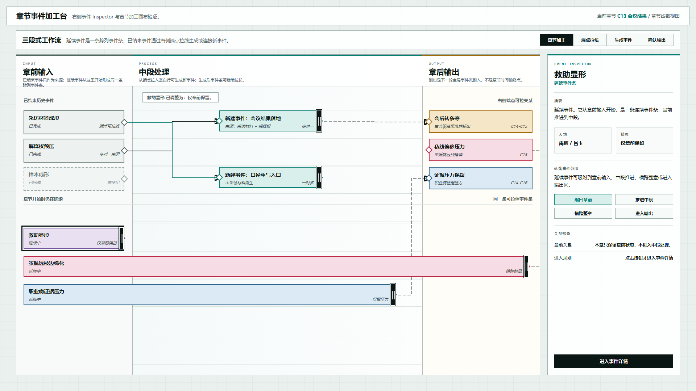
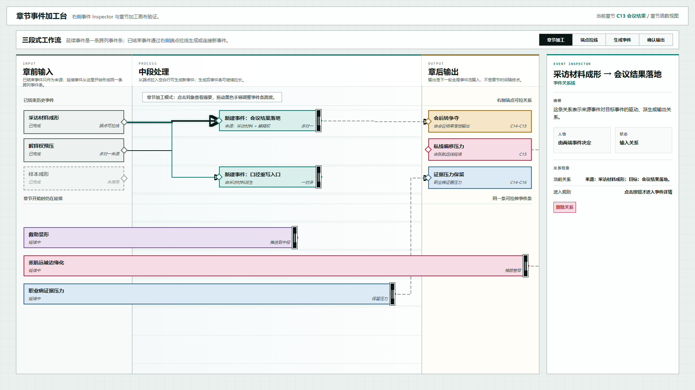
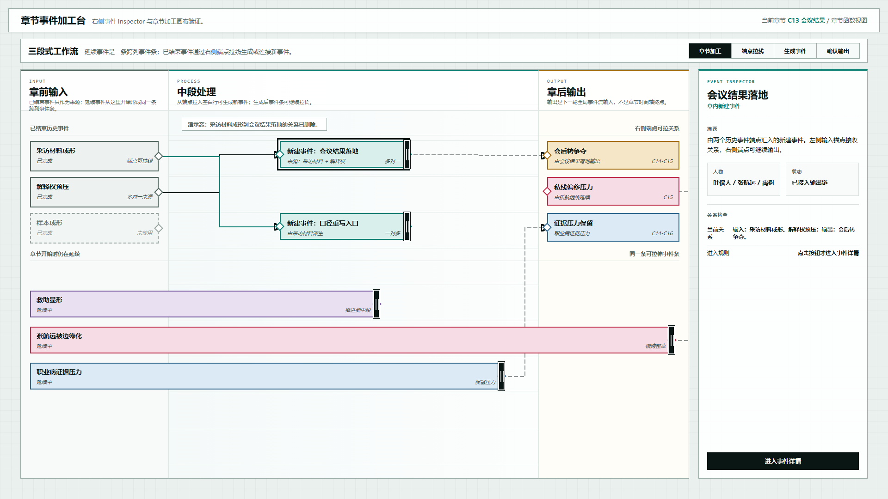

# 叙事验证工具：延续事件收缩与关系线编辑原型 v24

## 元信息

- 版本：v24
- 生成时间：2026-06-22 00:36:47
- 状态：待用户确认
- 目标画板：1920 x 1080
- 原型入口：`source/index.html`
- 继承版本：v23 右侧事件 Inspector 章节加工台原型
- 关联设计说明：`../../设计说明/2026-06-22-延续事件范围吸附与关系线编辑设计-v0.7.md`
- 评审图：
  - `01-延续事件可缩回章前-1920x1080.png`
  - `02-关系线可选中Inspector-1920x1080.png`
  - `03-关系删除后状态-1920x1080.png`

## 本版定位

本版修复两个交互缺口：

1. 延续事件可以缩回到章前输入阶段，表示“本章只保留章前状态，不进入中段处理”。
2. 关系线升级为可选中的对象，选中后右侧 Inspector 显示来源、目标和删除按钮。

## 非目标

- 不实现持久化保存。
- 不展开完整事件详情页。
- 不实现复杂关系类型编辑器。
- 不改变右侧 Inspector 的总体布局。

## 图文证据

### 01-延续事件可缩回章前-1920x1080.png



展示延续事件 `救助显形` 缩回章前输入后的状态。右侧 Inspector 中显示四个吸附按钮：缩回章前、推进中段、横跨整章、进入输出。

### 02-关系线可选中Inspector-1920x1080.png



展示关系线被选中后的状态。右侧 Inspector 显示来源事件、目标事件、关系类型，并出现 `删除关系` 按钮。

### 03-关系删除后状态-1920x1080.png



展示删除 `采访材料成形 -> 会议结果落地` 关系后的状态。两端事件仍然存在，只移除当前关系线。

## 原型到实现映射

- 目标页面：章节事件加工台。
- 主对象：章节函数，示例为 `C13 会议结果`。
- 核心组件：
  - 已结束历史事件来源卡
  - 连续延续事件条
  - 延续事件范围吸附按钮
  - 可选中关系线
  - 关系 Inspector
  - 删除关系按钮

## 允许偏差与不可接受偏差

允许偏差：

- 四个吸附按钮的文案可以继续调整。
- 选中关系线的高亮粗细可以继续微调。
- 删除关系后是否自动选中目标事件可以继续讨论。

不可接受偏差：

- 延续事件不能缩回章前。
- 关系线只能展示、不能选中。
- 删除关系会删除两端事件。
- 关系对象仍然不进入 Inspector。

## 查看与再生成

打开 HTML：

```powershell
Start-Process 'C:\OpenCodeWorkSpace\TestProject\文章重写\验证工具\原型包\2026-06-22-003647-叙事验证工具-延续事件收缩与关系线编辑原型-v24\source\index.html'
```

截图使用 Chrome Headless，视口固定为 `1920 x 1080`。
