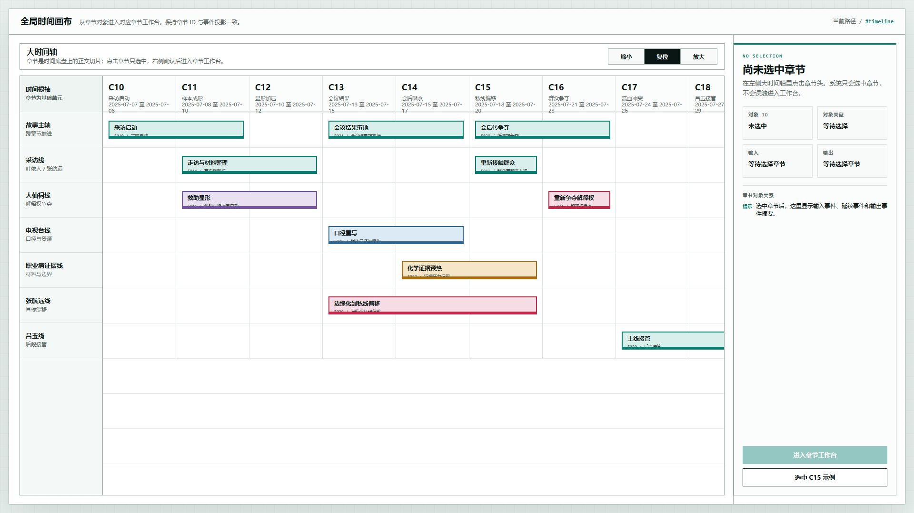
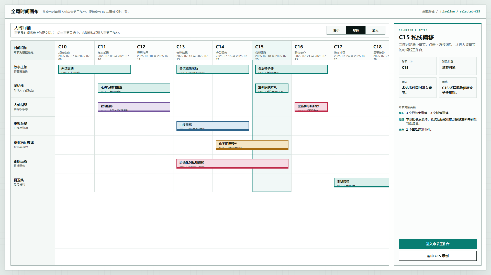
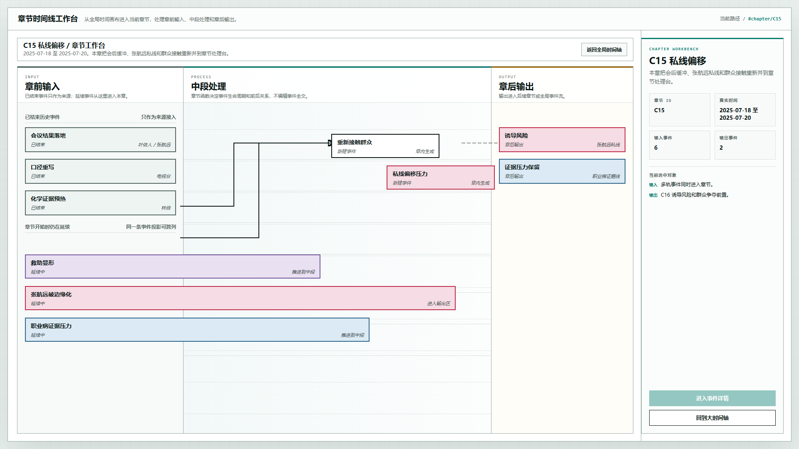

# 叙事验证工具：全局时间轴进入章节工作台原型 v25

## 元信息

- 版本：v25
- 生成时间：2026-06-22 01:24:41
- 状态：待用户确认
- 目标画板：1920 x 1080
- 原型入口：`source/index.html`
- 继承版本：
  - v9 真实时间轴底盘原型
  - v24 延续事件收缩与关系线编辑原型
- 关联设计说明：
  - `../../设计说明/2026-06-22-核心对象定义与系统记录总纲-v0.9.md`
  - `../../设计说明/2026-06-22-事件定义与系统记录设计-v0.8.md`
  - `../../设计说明/2026-06-22-全局时间轴与章节工作台贯通设计-v1.0.md`

## 本版定位

本版只解决一个关键问题：

从全局时间画布选中章节后，通过 Inspector 的显式按钮进入该章节的时间线工作台。

流程为：

```text
全局时间画布 -> 点击章节 -> Inspector 确认 -> 进入章节工作台
```

## 非目标

- 不实现完整事件详情页。
- 不实现后端持久化。
- 不实现章节工作台内复杂拖拽编辑。
- 不改变 v24 已验证的右侧 Inspector 总体方向。

## 设计依据

1. 用户要求打通“大时间轴”和“章节工作台”的联系。
2. 用户明确要求点击对象不能误触进入，必须通过 Inspector 或明确按钮确认。
3. 现有对象定义已经明确：章节是加工单元，事件是变化单元，剧情线是组织单元。
4. 本版把章节 ID 作为两个页面之间的连接点。

## 画板规格与布局预算

- 画板：1920 x 1080
- 全局时间画布：
  - 左侧主画布约 80%
  - 右侧 Inspector 约 20%
- 章节工作台：
  - 左侧三段式工作台约 80%
  - 右侧 Inspector 约 20%

## 评审图

### 01-全局时间轴默认状态-1920x1080.png



展示默认进入 `#timeline` 后的全局时间画布。此时尚未选中章节，右侧 Inspector 显示等待选择。

### 02-C15章节选中状态-1920x1080.png



展示点击 C15 章节后的状态。章节列高亮，右侧 Inspector 显示 C15 的输入、输出和事件投影摘要，`进入章节工作台` 按钮可用。

### 03-C15章节工作台-1920x1080.png



展示从 C15 进入章节工作台后的状态。工作台显示章前输入、中段处理、章后输出和右侧 Inspector。

## 原型到实现映射

| 原型区域 | 系统对象 |
| --- | --- |
| 全局时间画布章节列 | `chapter` |
| 全局事件条 | `event` + `storylineEventMembership` |
| 章节工作台 | `chapter` + `chapterEventProjection` |
| 工作台事件条 | `chapterEventProjection` |
| 工作台关系线 | `eventRelation` |
| 右侧 Inspector | 当前选中对象的摘要投影 |

## 允许偏差与不可接受偏差

允许偏差：

- 后续可以继续微调章节列高亮样式。
- 工作台中的示例事件可以替换为真实结构化数据。
- 路由可以从 hash 路由换成正式前端路由。

不可接受偏差：

- 点击章节后直接跳转。
- 进入工作台后丢失当前章节 ID。
- 工作台显示的不是当前选中章节。
- Inspector 没有明确进入按钮。

## 查看与再生成

打开 HTML：

```powershell
Start-Process 'C:\OpenCodeWorkSpace\TestProject\文章重写\验证工具\原型包\2026-06-22-012441-叙事验证工具-全局时间轴进入章节工作台原型-v25\source\index.html'
```

截图视口固定为 `1920 x 1080`。

