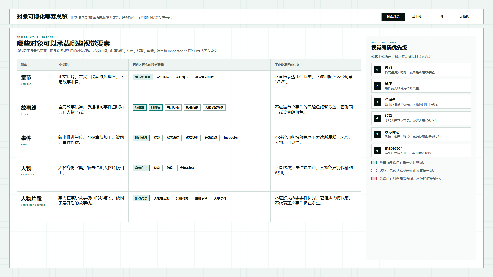
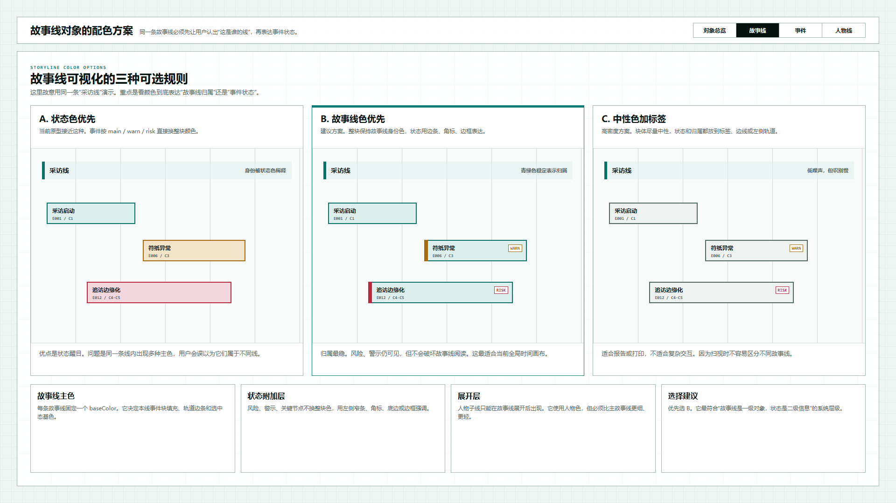
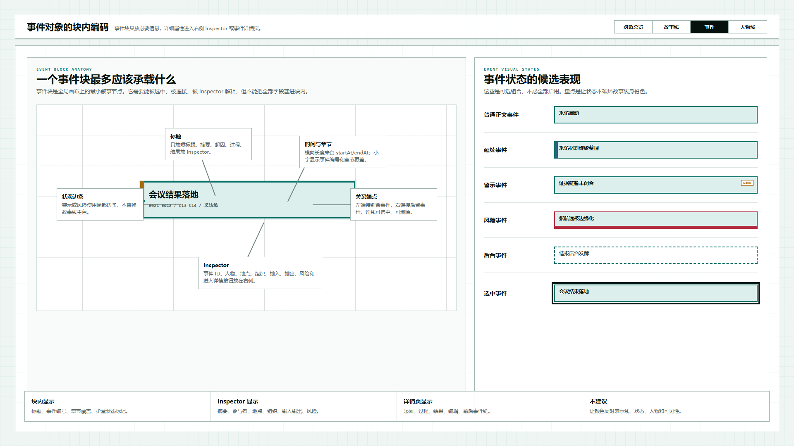
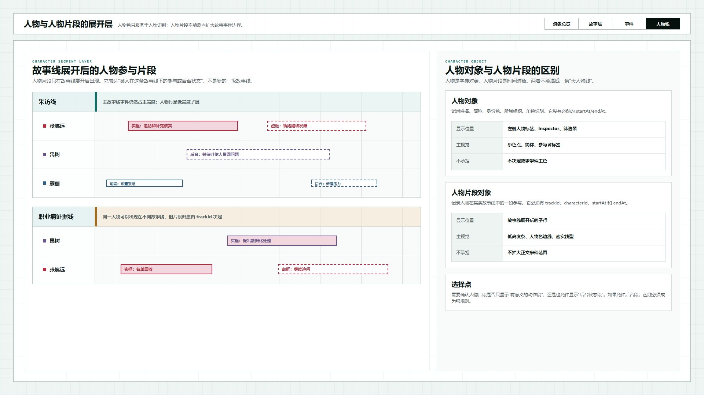

# 叙事验证工具 - 对象可视化要素示意 V1

## 元信息

- 版本：对象可视化要素示意 V1
- 生成时间：2026-06-23
- 状态：已确认设计方向
- 目标画板：1920 x 1080
- 源文件：`source/index.html`
- 本版主题：定义章节、故事线、事件、人物、人物片段这些对象可以承载哪些画布视觉要素

## 本版定位

本版不是运行态功能实现，也不替代当前“基准时间轴原型 V1”。它只用于回答一个设计问题：

```text
系统对象有哪些字段，哪些字段能进入画布，进入画布后用什么视觉要素表达。
```

当前基准时间轴已经能画出章节、故事线、事件和人物子线，但还缺一份明确的“对象与视觉编码”说明。本版先用四张图把可选方案画出来，供后续确认。

## 本轮确认结论

用户确认：

```text
故事线选择 B 方案。
其他对象可视化规则按本版建议执行。
```

因此后续实现应遵守：

1. 故事线身份色优先。
2. 事件状态使用局部标记，不覆盖故事线主色。
3. 人物对象和人物片段对象分开。
4. 人物片段使用低高度、人物色边线、虚实线型表达。
5. 详细属性进入右侧 Inspector 或对象详情页，不全部塞进画布块内。

## 非目标

- 不修改当前 `source/data/story.json`。
- 不修改当前基准时间轴页面。
- 不定义最终颜色值。
- 不做真实拖拽和编辑交互。
- 不代替后续正式对象定义文档。

## 设计依据

- 用户要求：需要看到故事线、人物线、人物对象、事件对象分别支持哪些视觉要素展示。
- 现有事实：当前基准时间轴已经存在 `chapters`、`tracks`、`characters`、`events` 四类数据。
- 设计判断：当前视觉问题的根源不是单个颜色不好，而是故事线身份色、事件状态色、人物身份色混在同一个视觉层级。

## 图文证据链

### 01-对象可视化要素总览-1920x1080.png



- 评阅状态：已确认方向
- 设计依据：先把对象分清，再讨论颜色、线型和 Inspector。
- 需要判断：后续是否还需要单独增加“组织”“地点”“证据”等对象。
- 关键观点：位置、长度、归属色、线型、状态标记、Inspector 应该有固定优先级。

### 02-故事线配色方案-1920x1080.png



- 评阅状态：已确认采用 B 方案
- 设计依据：回应“同一条故事线为什么出现多种颜色”的问题。
- 结论：采用 B 方案，即“故事线身份色优先，事件状态用局部标记表达”。
- 关键观点：故事线是一级对象，状态是二级信息，不应让状态色覆盖故事线身份。

### 03-事件块编码方案-1920x1080.png



- 评阅状态：已确认方向
- 设计依据：事件是全局时间轴上的最小叙事节点，但不能把所有字段都塞进块内。
- 结论：事件块内只保留标题、事件编号、章节覆盖和少量状态标记；摘要、人物、地点、组织、输入输出进入 Inspector 或事件详情页。
- 关键观点：事件状态可以用边条、角标、底边、虚线、选中外描边表达。

### 04-人物线编码方案-1920x1080.png



- 评阅状态：已确认方向
- 设计依据：人物对象和人物片段对象不能混成一条“大人物线”。
- 结论：人物对象和人物片段对象分开；后台状态段如进入画布，必须使用虚线框作为强规则。
- 关键观点：人物对象没有必然起止时间，人物片段才有 `trackId / characterId / startAt / endAt`。

## 原始材料说明

本版无外部原始图片。

## 原型到实现映射

- 目标页面：全局时间轴与章节工作台的对象定义层。
- 主对象：章节、故事线、事件、人物、人物片段。
- 后续映射：
  - `schema.json` 需要补充对象字段含义。
  - `story.json` 需要把故事线身份色和事件状态分开记录。
  - `index.html` 渲染逻辑需要从“事件 tone 决定整块颜色”调整为“故事线 baseColor 决定主色，事件状态决定局部标记”。

## 允许偏差

- 颜色值可以调整。
- 事件状态类型可以增减。
- 人物片段是否显示后台状态可以继续讨论。
- Inspector 字段可以在后续对象定义文档中细化。

## 不可接受偏差

- 不能继续让同一个视觉颜色同时表达故事线、事件状态、人物和可见性。
- 不能把人物对象直接画成有起止时间的主轴对象。
- 不能让人物后台片段扩大正文事件边界。
- 不能让章节承担事件状态表达。

## 查看与再生成

打开源文件：

```text
source/index.html
```

可用 hash：

```text
#overview
#storyline
#event
#character
```

截图命令示例：

```powershell
$src = 'C:\OpenCodeWorkSpace\TestProject\文章重写\验证工具\原型包\2026-06-23-叙事验证工具-对象可视化要素示意-v1\source\index.html'
$uri = [System.Uri]::new($src).AbsoluteUri
npx --yes playwright screenshot --viewport-size=1920,1080 "$uri#overview" "01-对象可视化要素总览-1920x1080.png"
```

## 评审结论

当前状态：已确认设计方向，可作为下一轮 schema 与渲染逻辑调整依据。
